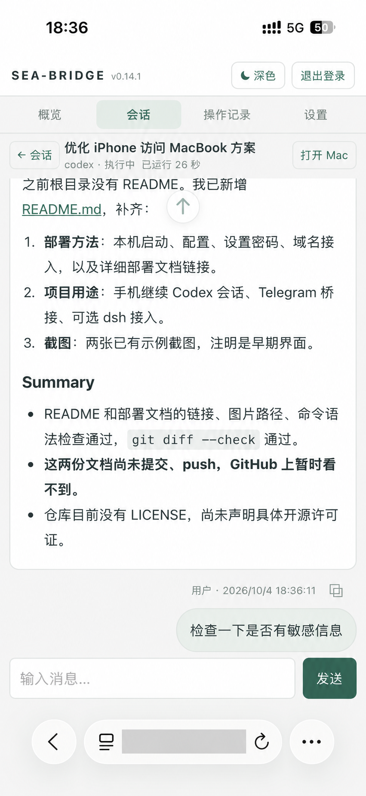
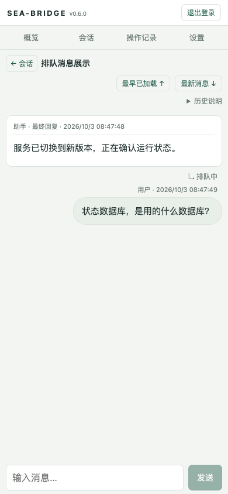
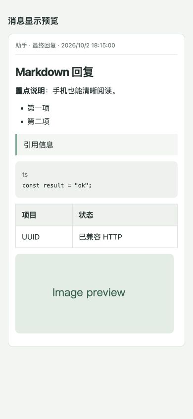

# Sea-Bridge

在手机浏览器或 Telegram 中，查看并继续 Mac 上的 Codex 会话，也可按需接入 dsh。

Sea-Bridge 是部署在自己 Mac 上的会话桥接服务。它提供中文 Web 控制台，把本机 Codex 会话、项目目录、模型目录与消息操作连接到手机；通过 Cloudflare Tunnel 使用自己的 HTTPS 域名远程访问。

它复用本机已安装并登录的 Codex，不提供独立模型服务。当前主要部署和验证平台为 macOS，应用版本为 **v0.14.3**。

## 能做什么

- **查看和继续会话**：按执行平台、创建来源、状态、标题查找会话，阅读用户消息和助手最终回复，向已有会话发送消息。
- **新建会话**：选择项目、模型并发送首条消息；项目下拉框支持直接输入搜索，500ms 防抖。
- **手机阅读**：响应式页面、Markdown 展示、附件预览、消息复制、浅色/深色主题及消息定位。
- **查看执行与交付状态**：概览、操作记录、失败提示及连接恢复；“已入队”“来源已接受”与“执行完成”分别展示，避免误把提交当成完成。
- **Telegram 桥接**：会话反馈、消息回复及支持的审批流；Telegram 是入口和通知通道，Codex/dsh 是执行来源。
- **可选 dsh 接入**：接入本机连接器后查看和操作 dsh 会话，具体能力取决于宿主和连接器状态。
- **账号密码登录**：单管理员账号、本机设置和重置密码、设备登录管理；没有默认密码或公开注册。

适合需要离开电脑后，通过手机查看任务进度、继续已有会话或创建新任务的个人用户。当前没有多用户角色或权限隔离；不要把同一实例当作多个用户相互隔离的工作平台。

## 界面截图

### v0.14.1 移动端示例

手机 Safari 中的会话界面，展示 Markdown 回复、执行状态、消息定位、输入框和主题切换。底部地址栏域名已遮挡；截图中的对话是当时的文档编写记录，其中提及的提交状态和许可证状态以当前仓库为准。



### 早期界面示例

以下两张截图使用示例内容，展示手机聊天和 Markdown 阅读能力，不代表当前版本的全部布局。

<table>
  <tr>
    <th>手机会话与提交状态</th>
    <th>Markdown 消息阅读</th>
  </tr>
  <tr>
    <td></td>
    <td></td>
  </tr>
</table>

## 运行前准备

| 项目 | 要求 |
| --- | --- |
| 电脑 | macOS；远程访问期间需保持开机、联网及用户会话可用 |
| 运行环境 | Bun；当前验证版本 1.4.2；Node.js 用于 JS 语法检查，Python 3 用于 hooks 与文档中的运维脚本 |
| 依赖安装 | pnpm，仓库使用 `pnpm-lock.yaml`；当前应用运行依赖由 Bun 提供 |
| Codex | 本机已安装、登录，并存在对应状态库；CLI 路径需与实际安装一致 |
| Telegram | 自己的 Bot token、允许的用户 ID 与聊天 ID；当前完整应用启动必须提供这三项 |
| 远程访问 | 自己管理的 Cloudflare 域名区域及 cloudflared；仅本机使用时可不配置 Tunnel |
| dsh | 可选；需要独立安装并运行宿主及 Sea-Bridge 连接器 |

浏览器不需要安装额外客户端。手机远程访问采用 HTTPS 域名；Mac 上应用默认只监听 `127.0.0.1:7310`。

## 快速开始：先在本机运行

### 1. 获取源码、安装已有依赖

```bash
git clone https://github.com/blairevan/sea-bridge.git
cd sea-bridge
pnpm install --frozen-lockfile
bun run typecheck
bun test
bun run build
```

从包含 v0.14.3 的代码版本部署。不要只复制 `dist/main.js`：发布运行还需要同一构建中的 `dist/web/` 静态资源。

### 2. 创建本机环境文件

```bash
mkdir -p "$HOME/.config/sea-bridge"
chmod 700 "$HOME/.config/sea-bridge"
test -f "$HOME/.config/sea-bridge/env" || touch "$HOME/.config/sea-bridge/env"
chmod 600 "$HOME/.config/sea-bridge/env"
```

用编辑器填写该文件。下面三项留空的 Telegram 配置必须换成你自己的值；示例不包含真实凭据：

```bash
TELEGRAM_BOT_TOKEN=
ALLOWED_USER_ID=
ALLOWED_CHAT_ID=

SEA_BRIDGE_WEB_ENABLED=true
SEA_BRIDGE_WEB_PORT=7310
SEA_BRIDGE_BUN_BIN="$HOME/.bun/bin/bun"
SEA_BRIDGE_LOG_LEVEL=info
```

`SEA_BRIDGE_BUN_BIN` 应改成 `command -v bun` 返回的绝对路径。本机使用时先不设置 `SEA_BRIDGE_WEB_REMOTE_ORIGIN`。默认数据和本机控制 socket 位于 `~/Library/Application Support/SeaBridge/`，Codex 状态库默认位于 `~/.codex/`。

应用不是独立的“只启用网页、不使用 Telegram”的服务：缺少三个必填 Telegram 配置时启动会失败。不要把网页登录密码写进环境文件，也不要将环境文件提交到仓库。

### 3. 启动服务

在源码根目录执行：

```bash
./scripts/run-sea-bridge.sh
```

该脚本加载 `~/.config/sea-bridge/env` 并前台运行应用。保持此终端运行，浏览器打开 `http://127.0.0.1:7310`，应该看到登录页；按 Ctrl+C 停止。已有后台实例时，不要再启动一个占用相同端口的前台实例。

### 4. 设置网页登录账号密码

另开一个 Mac 本机终端，进入同一份源码目录：

```bash
cd /实际路径/sea-bridge
set -a
source "$HOME/.config/sea-bridge/env"
set +a
bun run web:account
```

按提示输入账号、密码和确认密码，密码输入不显示。命令需要真实终端，不能传密码参数或使用管道。

- 账号为 3–64 位英文字母、数字、`_`、`.`、`-`，首位是字母或数字。
- 密码为 12–256 个字符，不允许控制字符或全部空白。
- 忘记密码时再次执行同一命令；重置立即使全部旧设备登录失效。
- 没有默认账号密码，首次设置前任何网页登录都会失败。

使用刚设置的账号密码登录本机页面。服务端仅保存密码哈希，设备会话有效期为 30 天。

## 手机通过自己的域名访问

```text
手机 → 自己的 HTTPS 域名 → Cloudflare Tunnel → Mac 的 127.0.0.1:7310
```

1. 使用自己的 Cloudflare 域名区域，创建独立 Tunnel，将主机名映射到 `http://127.0.0.1:7310`。
2. 在应用环境文件设置 `SEA_BRIDGE_WEB_REMOTE_ORIGIN=https://你的完整域名`，不要带末尾 `/` 或路径。
3. 配置对应 DNS 路由，运行 Tunnel，并重启应用。
4. 手机打开自己的 HTTPS 域名，使用第 4 步设置的应用账号密码登录。

域名本身不设置密码，密码在 Sea-Bridge 中设置。远程密码登录必须使用 HTTPS，不需要给路由器开放 7310 端口。本项目当前部署采用应用账号密码；Cloudflare Access 是可选的额外门禁，不是必需步骤。

**完整可执行步骤见 [部署与运维指南](docs/deployment.md)**：包含配置项、Tunnel 创建和 DNS、LaunchAgent 自启动、重启/停止、发布快照、SQLite 备份、回退与故障排查。文档中的域名、用户目录和 Tunnel UUID 已使用示例值，部署时需要替换为自己的配置。

## 常用命令

| 命令 | 用途 |
| --- | --- |
| `./scripts/run-sea-bridge.sh` | 加载本机环境文件并前台启动 |
| `bun run web:account` | 设置或重置管理员账号密码；服务必须已经运行 |
| `bun run typecheck` | TypeScript 类型检查 |
| `bun test` | 完整自动化测试 |
| `node --check src/web/public/app.js` | 浏览器 JS 语法检查 |
| `bun run build` | 构建 `dist/main.js` 与 `dist/web/` |
| `bun run dsh-connector:check` | 检查可选 dsh 连接器快照 |
| `bun run dsh-connector:install` | 安装可选 dsh 连接器；不会自动启动宿主 |

## 常见问题

**网页打不开**：检查 Web 开关、7310 监听和服务日志。主进程存在不代表 Web 启动成功；本机能访问后再检查 Tunnel 和 DNS。

**域名打开后 403**：检查 `SEA_BRIDGE_WEB_REMOTE_ORIGIN` 是否与浏览器域名完全一致，以及代理是否错误改写 Host/Origin。

**密码正确却登录失败**：确认已设置账号、使用同一应用数据库，并排除每分钟 5 次的来源尝试限制。当前所有远程请求共用限流桶，频繁尝试后等待约一分钟再试。

**显示“状态未知”或目录不可用**：这取决于 Codex/dsh 当前提供的能力、CLI 和状态文件，不等同于密码错误。只读历史可用不代表发送、审批或实时状态全部可用。

**修改代码后手机没有变化**：构建不会自动切换后台发布目录。按部署文档更新发布快照、重载 LaunchAgent；每次发布递增版本，避免静态资源旧缓存。

## 文档与项目结构

- [部署与运维指南](docs/deployment.md)：给使用者和维护者的完整操作步骤。
- [版本与验收记录](docs/ai/web-console-versioning.md)：历史功能变化和验证边界。
- `src/web/`：Web 服务、认证、来源适配与浏览器界面。
- `src/desktop/`：Codex 桌面会话与消息桥接。
- `src/telegram/`：Telegram 交互与通知。
- `src/dsh/`、[`connectors/dsh/`](connectors/dsh/README.md)：可选 dsh 桥接；`scripts/dsh/` 提供诊断工具。
- `scripts/`：启动、构建、本机账号和连接器管理。
- `tests/`：认证、消息、来源和界面回归测试。

GitHub 仓库目前公开可访问；`package.json` 的 `private: true` 表示不发布 npm 包，不代表仓库私有。仓库目前没有 LICENSE 文件，未声明具体开源许可证。
