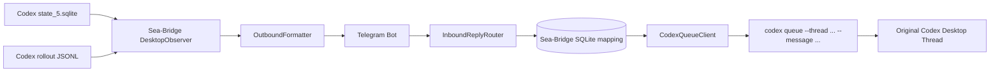

# Sea-Bridge Telegram ↔ Codex Desktop 消息桥接设计

日期：2026-09-16  
状态：待用户审阅  
范围：Codex Desktop 本地会话与 Telegram 单用户私聊的双向消息桥接

## 1. 目标与边界

目标是让用户离开 Mac 后仍能：

1. 在 Telegram 收到 Codex Desktop 每轮的最终回复与关键状态变化；
2. 回复某条 Telegram 通知，将消息准确投递回产生该通知的同一个 Codex Desktop 会话。

V1 不依赖 Vibe Notch、Codex Hook、审批机制、第二个 App Server 或 Headless fallback。Vibe Notch 保持原有本地 UI 与钉钉通知职责，不读取、不修改其数据和代码。

本设计的两项外部能力必须经过目标机 PoC：

- Codex 本地状态库和 rollout JSONL 可稳定提供会话、turn、最终回复与状态证据；
- `codex queue --thread <threadId> --message <text>` 能把消息投递到对应的已存在 Desktop thread。

PoC 未通过时，必须保留相应能力为 unavailable，不以第二个 App Server 或 UI 自动化替代。

## 2. 候选方案与裁决

### 方案 A：Sea-Bridge 直接观测本地 Codex 数据并调用 `codex queue`

Sea-Bridge 读取 `~/.codex/state_5.sqlite` 中的 thread 元数据，并增量解析该 thread 的 rollout JSONL。Telegram 入站回复通过安全的子进程参数调用 `codex queue`。

优点：

- 与 Vibe Notch 解耦；
- threadId 是持久化的一等关联键；
- 入站路由不依赖 Hook 生命周期；
- 不需要触碰 Desktop App Server 私有 stdio 拓扑。

限制：

- 必须验证 `codex queue` 对 Desktop thread 的实际语义；
- 本地状态库与 JSONL 格式升级后需要版本指纹和回归 gate。

**裁决：V1 采用。**

### 方案 B：解析 Codex Desktop 诊断日志

Desktop 日志不是稳定产品接口，内容面向诊断，可能缺失最终回复和 thread correlation。

**裁决：不采用。**

### 方案 C：复用 Vibe Notch 内部 SessionStore

Vibe Notch 已有状态观察能力，但依赖其 Swift 进程内对象会把两个产品的生命周期、升级和故障域绑定在一起。

**裁决：不采用。**

## 3. 架构



### 3.1 DesktopObserver

职责：

- 轮询 `state_5.sqlite` 的 `threads` 表，识别新建或更新的 Desktop thread；
- 根据 `rollout_path` 增量读取 JSONL，不直接修改 Codex 文件；
- 为每个 thread 识别：
  - `threadId`；
  - 标题（`name` 优先，回退 `title`）；
  - 当前 turn；
  - `started`、`waiting_for_input`、`completed`、`failed`、`interrupted` 状态；
  - 每轮最终助手文本。
- 对同一 `threadId + turnId + finalMessageHash` 只发一次通知。

状态识别必须以真实 JSONL fixture 建立版本适配器。无法判定的事件只记录审计，不发送“完成”通知。

### 3.2 OutboundFormatter

Telegram 推送类型：

| 状态 | 文案内容 |
|---|---|
| started | 会话标题与“开始执行” |
| waiting_for_input | 会话标题与“等待输入” |
| completed | 会话标题、最终回复脱敏摘要、执行完成 |
| failed / interrupted | 会话标题、状态与脱敏错误摘要 |

每条消息保存映射：

```text
telegram_chat_id
telegram_message_id
thread_id
turn_id
event_kind
event_fingerprint
sent_at
```

正文最多发送配置上限字符。超长最终回复截断，并标识“内容已截断”；不发送环境变量、Cookie、Token、完整 diff 或完整命令输出。

### 3.3 InboundReplyRouter

仅接受同时满足以下条件的 Telegram update：

1. user ID 与 chat ID 都在白名单；
2. 消息是对 Sea-Bridge 发出的 Telegram 通知的 `reply_to_message`；
3. `reply_to_message.message_id` 能在本地映射表定位到唯一 `threadId`；
4. update ID 尚未处理。

成功时调用：

```text
codex queue --thread <threadId> --message <text>
```

调用必须使用参数数组启动子进程，禁止 shell 拼接。文本被包装为一段明确来源的用户输入，例如：

```text
[Telegram reply]
<user text>
```

普通 Telegram 消息不猜测“当前会话”，统一返回：请回复某条 Sea-Bridge 会话通知以选择目标会话。

### 3.4 CodexQueueClient

职责：

- 定位当前 Desktop 内嵌 Codex CLI 的绝对路径，优先 `/Applications/ChatGPT.app/Contents/Resources/codex`；
- 以 `--thread` 精确指定 thread UUID；
- 记录调用开始、退出码、标准错误摘要和结果；
- 不把完整 Telegram 文本、Token 或命令行参数中的敏感数据写入日志；
- 对不确定结果标记 `delivery_unknown`，不自动重放。

V1 的交付状态：

```text
received -> validated -> dispatching -> delivered
                                  |-> failed
                                  |-> delivery_unknown
```

`delivered` 只表示 `codex queue` 成功退出；是否由 Desktop 最终处理，由下一轮 DesktopObserver 事件作为后续证据。

## 4. SQLite 数据模型

在 Sea-Bridge 自有数据库增加：

```sql
CREATE TABLE desktop_message_links (
  telegram_chat_id TEXT NOT NULL,
  telegram_message_id INTEGER NOT NULL,
  thread_id TEXT NOT NULL,
  turn_id TEXT,
  event_kind TEXT NOT NULL,
  event_fingerprint TEXT NOT NULL UNIQUE,
  sent_at INTEGER NOT NULL,
  PRIMARY KEY (telegram_chat_id, telegram_message_id)
);

CREATE TABLE telegram_thread_deliveries (
  telegram_update_id INTEGER PRIMARY KEY,
  reply_to_message_id INTEGER NOT NULL,
  thread_id TEXT NOT NULL,
  text_hash TEXT NOT NULL,
  status TEXT NOT NULL,
  queue_exit_code INTEGER,
  error_code TEXT,
  created_at INTEGER NOT NULL,
  completed_at INTEGER
);

CREATE TABLE desktop_observer_cursors (
  thread_id TEXT PRIMARY KEY,
  rollout_path TEXT NOT NULL,
  byte_offset INTEGER NOT NULL,
  schema_fingerprint TEXT NOT NULL,
  last_event_fingerprint TEXT,
  updated_at INTEGER NOT NULL
);
```

所有状态转换都用 SQLite 条件更新实现 compare-and-set，防止 Telegram 重投或进程重启导致重复排队。

## 5. 版本与可靠性 Gate

目标机当前 Desktop 内嵌 Codex 版本为 `0.154.0-alpha.6.2`，此前针对 `0.153.4` 的 Hook fixture 不能复用为本方案的 JSONL 事件证据。

实施前必须：

1. 记录 Desktop App、内嵌 Codex CLI、SQLite schema 和 JSONL 样例 hash；
2. 采集真实 Desktop thread 的 start、completed、failed 与等待输入 fixture；
3. 验证 `codex queue` 向一个指定 Desktop thread 投递测试文本；
4. 验证两个并行 thread 的 Telegram 回复不会串线；
5. 验证 Sea-Bridge 重启后，既有 Telegram 映射仍可投递；
6. 验证同一 Telegram update 重放不会二次调用 `codex queue`。

任何 gate 失败时，Telegram 只显示明确失败状态；不得把消息改投另一个 thread。

## 6. 验收标准

1. Desktop 每轮完成、等待输入、失败或中断，Telegram 各收到一次正确的状态通知；
2. 完成通知包含对应 thread 的最终回复摘要；
3. Telegram 回复某一通知后，消息进入该通知对应的 Desktop thread；
4. 两个并行 Desktop thread 与两条 Telegram 通知之间保持一对一关联；
5. 非白名单用户、非白名单 chat、无 `reply_to_message` 或过期映射均不触发 Codex 命令；
6. Sea-Bridge 重启和 Telegram 重投不造成重复投递；
7. Vibe Notch、Hook 及审批配置均不是消息桥接的运行依赖。

## 7. 非目标

- 从 Telegram 主动中断 Desktop 当前 turn；
- Telegram 远程审批；
- Telegram 处理 Desktop `requestUserInput` 原生 pending request；
- 发送每个流式中间 token；
- 用第二个 App Server 或 GUI 自动化伪装原 Desktop 会话。
