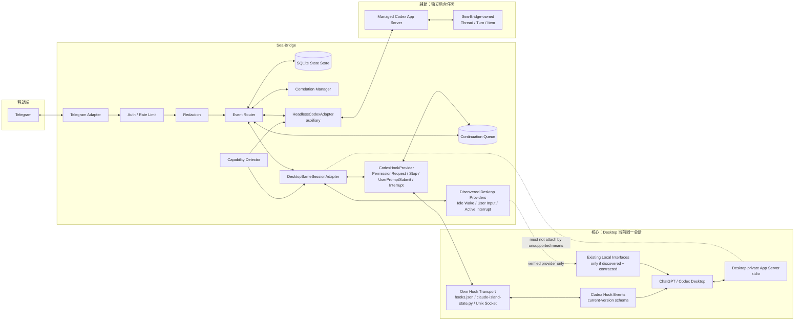
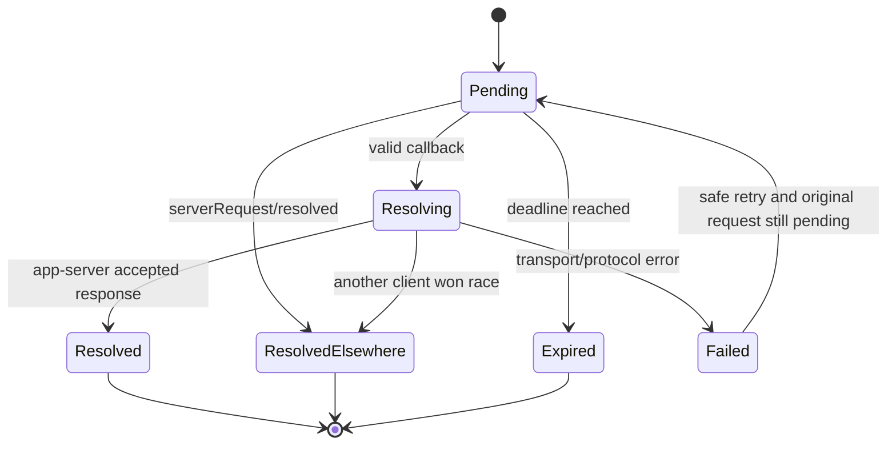

# Telegram 与 Codex Desktop 双向闭环交互方案设计（Sea-Bridge）

> 文档状态：**已审查修订（Revision 6 - Desktop 消息桥实现与待实机 PoC）**  
> 修订日期：**2026-09-16**  
> 适用范围：`/opt/app/aitools/sea-bridge`  
> 目标：通过 Telegram **控制 Codex Desktop 当前同一个会话**。Revision 5 基于现成项目源码与官方 Codex Hook 能力重新收口：`PermissionRequest` 作为同会话审批主入口，`Stop` Hook + Telegram 队列作为“当前 turn 结束边界继续同一 Desktop thread”的首选 PoC；Desktop 已完全 idle 时的主动唤醒仍是核心技术缺口。Sea-Bridge 自托管 Headless App Server 仅作为辅助独立任务能力，不能替代核心的 Desktop 同会话控制目标。

---

## Revision 6：Desktop 消息桥实施记录（2026-09-16）

### Revision 6.1：当前 Desktop 版本的历史投影修正（2026-09-16）

在 `0.154.0-alpha.6.2` 现场验证中，`rollout-*.jsonl` 不能作为逐行 JSON 的稳定事件源：实际文件包含非 JSONL 的多行内容。`codex migrate-rollouts --thread <id> --json` 显示目标 thread 已处于 `already_paginated`，并且 `~/.codex/thread_history_1.sqlite` 提供 `thread_turns`、`thread_items` 与 `thread_history_projection_state`。因此消息桥已改为只读该历史投影库：以 `thread_turns.rollout_ordinal` 做增量游标，以 `final_agent_item_id -> thread_items.item_json` 读取最终 agent 文本。

新版通知使用 Telegram `force_reply=true`。用户通过该输入框回复时，Bot API 会携带 `reply_to_message`，Sea-Bridge 再以持久化的 notification 映射定位唯一 thread。普通裸消息仍不猜测路由。

### Revision 6.2：首次基线并发窗口修正（2026-09-16）

首次启动若逐个 thread 查询并写入游标，长列表会形成窗口：启动后的新 turn 可能在某个 thread 尚未基线化前完成，随后被错误视作历史而不通知。观察器现以单次 `thread_history_1.sqlite` 聚合查询取得所有 active thread 的 `MAX(rollout_ordinal)` 快照，再写入基线；后续轮询才消费快照之后的 turn。该修正已通过单测、类型检查和构建验证。

用户已将当前优先级收口为独立的“Desktop 消息通知与精确回复”能力：Codex Desktop 的每轮最终回复和状态变化发送到 Telegram；用户必须**回复某一条 Sea-Bridge 通知**，Sea-Bridge 才会将文本投递回该通知映射的原 Desktop thread。该路径不依赖 Vibe Notch，也不把审批作为主功能。

本次实现采用当前内嵌 Codex `0.154.0-alpha.6.2` 已暴露的本地数据和 CLI 表面：

1. 只读轮询 `~/.codex/state_5.sqlite` 的活跃 thread 元数据，并从每个 thread 的 rollout JSONL 增量解析 `started`、`waiting_for_input`、`completed`、`failed`、`interrupted` 与最终 assistant 文本；
2. Sea-Bridge 首次启动仅保存 JSONL EOF 游标，**不补发历史会话**；后续事件以 `threadId + turnId + eventFingerprint` 去重；
3. 每次 Telegram 通知持久化 `telegram_chat_id + telegram_message_id -> threadId + turnId` 映射；裸消息和未映射回复均不猜测目标会话；
4. 入站回复使用参数数组执行 `codex queue --thread <threadId> --message <text>`，不拼接 shell；Telegram update 以 SQLite CAS 防重，`delivered` 仅表示 CLI 退出码为 0；
5. 已完成状态库、JSONL 解析器、观察器、队列客户端、精确回复路由及服务接线。`bun test`（26 passed）、`bun run typecheck`、`bun run build` 均已通过。

本实施**尚未**完成实机闭环 PoC。因此 `DESKTOP_MESSAGE_BRIDGE` 保持 `pending_poc`：必须验证真实 Desktop 新 turn 能产生 Telegram 通知，且从 Telegram 回复后，原 Desktop thread 确实接收并处理 `codex queue` 消息。若 CLI 退出成功但 Desktop 未处理，不能宣称同会话回复已可用，也不得以 Headless 或第二 App Server 替代。

Revision 6 仅替代本文中与“Telegram 普通文本先进入 Stop Hook continuation queue”相冲突的主路径描述；旧 Hook 审批与 Stop contract 内容保留为独立、未验证的兼容能力，不参与本消息桥验收。

---

## 0. 审查结论

原方案方向可行，但直接按原文实施存在数个架构级风险。Revision 1–4 完成了 App Server 所有权、Desktop 同会话目标、Hook 与 Headless 能力边界的收口。Revision 5 又对 CodexHub、agent-relay、telegram-codex-bridge、Dexgram、destructive_command_guard 等现成实现进行了源码级核查，并重新核对官方 Codex Hook 语义。

核查结果改变了 Phase 0B 的重点：**不再把“Desktop steer”当作一个单一未知能力从零逆向。** 当前可优先验证两条官方/准官方同会话链路：`PermissionRequest` Hook 用于远程审批；`Stop` Hook 在当前 turn 准备结束时返回 continuation reason，用于消费 Telegram 队列并在同一 Desktop thread 继续工作。真正仍未解决的是 **Desktop 已完全 idle 后，从 Telegram 主动唤醒该 conversation 开启新 turn**。Headless 继续只作为辅助能力，不参与核心验收兜底。

### 0.1 必须修正的问题

| 等级 | 原设计问题 | 风险 | 本次修订 |
| --- | --- | --- | --- |
| P0 | 默认 Sea-Bridge 可以启动独立 Codex 通道并同时控制 Codex Desktop 当前 live thread | 两个 app-server 实例之间不共享同一个内存态 live thread，可能出现重复执行、状态漂移、无法解除审批 | 增加“单一 app-server 实例拥有 live thread”的硬约束和三种运行模式 |
| P0 | 将现有 Hook 路线继续视为“Legacy 私有协议” | 当前 Codex 已有正式 Hook 事件与 schema；继续按私有协议设计会错过 `session_id` / `turn_id` / `Stop` continuation 等官方语义 | 重命名为 `CodexHookProvider`。自有 Socket/脚本只是 provider transport；事件语义优先服从当前 Codex Hook schema，并为目标 Desktop 版本保存 fixture/contract |
| P0 | 将 `CODEX_APP_TOOLS_PIPE_PATH` / `send_message_to_thread` 当作稳定 API | 缺少当前 Codex 版本协议证明，可能属于历史/私有接口 | 改为 App Server `thread/*`、`turn/*` 标准协议；私有 Pipe 只允许存在于可替换适配器内部 |
| P0 | 超时后向 Socket 返回 `ask` | App Server 与 Legacy Hook 的响应契约不同；猜测响应值可能让请求挂起或误决策 | Headless App Server 按当前 schema 处理；Legacy Hook 的超时/断连行为必须由现场 contract fixture 明确，未验证前禁止发送 `ask`、`cancel`、`decline` 等猜测值 |
| P0 | 将审批 Hook 的能力外推为任意时刻的 Desktop steer / interrupt | `PermissionRequest`、`Stop`、`Interrupt`、`UserPromptSubmit` 的触发时机和输出语义不同；`Stop` continuation 也只能在 turn 结束边界生效 | 拆分 `DESKTOP_CONTINUATION`、`DESKTOP_IDLE_WAKE`、`DESKTOP_USER_INPUT`、`DESKTOP_INTERRUPT`。优先 PoC `Stop -> continuation`，idle wake 单独保留为技术缺口 |
| P1 | `/stop` 仅按“当前任务”执行 | 对 Sea-Bridge 自托管任务，active turn 在点击到处理之间可能发生切换，存在误杀新 turn 的竞态 | Telegram 卡片绑定明确 `threadId + turnId`；中断只作用于捕获到的 **Sea-Bridge-owned turn** |
| P1 | `Trust Session` 被描述成通用全局放行 | 容易把一次审批扩展成过宽授权 | 仅在上游该请求类型明确支持 `acceptForSession` 时显示；禁止 Sea-Bridge 自造全局绕过 |
| P1 | 使用原始命令字符串做 `auto_approve_patterns` | `ls ...; dangerous-command`、shell 拼接、换行等可绕过 | V1 默认关闭自动审批；后续只允许结构化 argv / cwd / tool type 规则，fail-closed |
| P1 | Telegram callback 直接携带业务参数的设计未约束 | Telegram `callback_data` 有 1–64 bytes 限制，也容易被伪造或重放 | callback 只携带短的随机 opaque token；真实请求保存在本地状态库 |
| P1 | 长轮询只描述“指数退避”，没有 update 幂等和崩溃恢复 | 重启时可能重复消费或漏消费审批点击 | 持久化 `update_id`、请求状态和幂等键；所有动作按 at-least-once 输入设计 |
| P1 | 审批消息可能直接发送完整命令、diff、环境信息 | Telegram 是外部服务，可能泄露 token、路径、URL query、私密源码 | 加入出站脱敏、长度限制、敏感字段默认折叠和禁止发送策略 |
| P1 | 热重载规则缺少原子校验 | 配置半写入或语法错误时可能导致意外放行 | 新配置先解析、schema 校验、语义校验，成功后原子替换；失败继续使用上一版 |
| P0 | 把所有收到的 Hook 事件都当成实时 Desktop 事件 | 社区近期报告目标 Desktop 版本附近可能在 memory consolidation 等后台流程中重新触发历史 Hook；若直接推送/执行审批会产生 stale action 风险 | 所有 Desktop Hook 写操作增加 `session_id + turn_id + timestamp/freshness + 本地观测状态` 校验；Revision 5 Phase 0B 必须专门验证 replay/stale 行为 |

### 0.2 当前上游能力基线（2026-09-10 核验）

当前 Codex App Server 已公开 Thread / Turn / Item 模型，并提供以下与本方案直接相关的协议能力：

- `thread/start`、`thread/resume`、`thread/list`；
- `turn/start`：在空闲 thread 上开始新 turn；
- `turn/steer`：向当前 active turn 追加用户输入，并通过 `expectedTurnId` 防止投递到错误 turn；
- `turn/interrupt`：按明确的 `threadId + turnId` 中断指定 turn；
- `item/commandExecution/requestApproval`：命令执行审批；
- `item/fileChange/requestApproval`：文件修改审批；
- `item/permissions/requestApproval`：权限申请；
- `item/tool/requestUserInput`：Codex 向用户提问；
- `serverRequest/resolved`：请求已被处理或因生命周期变化被清理；
- `item/completed` / `turn/completed`：最终事实状态。

协议会持续变化。实现不得手写一份长期不变的类型定义作为事实来源。安装或升级 Codex 后必须执行能力探测，并优先从当前安装版本生成 schema / TypeScript 类型。

### 0.3 Phase 0 现场实测裁决（2026-09-11 实机取证）

现场对当前 macOS 环境执行了 Phase 0 阻断门实测，取得关键事实与定模结论：

1. **双版本环境确认**：
   - 宿主全局 CLI（`/Users/<username>/.bun/bin/codex`）版本为 `0.147.0`；
   - Desktop 内嵌运行时（`/Applications/ChatGPT.app/Contents/Resources/codex`）版本为 `0.153.4`；
   - 成功通过内嵌运行时导出 `v0.153.4` 全套 App Server Schema（包含 115 个 ClientRequest 与 11 个 ServerRequest）。
2. **Desktop App Server 独占传输层确证**：
   - Desktop App Server（PID: 97292）由 `ChatGPT.app`（PID: 97220）直接以子进程启动；
   - 其 FD 0/1/2 均为内部匿名管道（stdio），未配置 `--listen unix://...` 或 `--listen ws://...`，也未启动多客户端共享控制套接字（`/Users/<username>/.codex/app-server-control/app-server-control.sock` 不存在）；
   - **裁决：按当前可观测 transport 与受支持接口，Mode A 无可用 Peer Client 接入路径**。除非改变 Desktop/app-server 启动拓扑，或未来上游开放可连接 endpoint，否则 V1 不实施该模式；不采用复制进程 FD、注入父子进程管道等未受支持手段绕过。
3. **Phase 0 技术路线结论（已由 Revision 5 进一步收口）**：
   - **Desktop 前台审批**：Revision 2 现场路径仍可作为 transport 参考，但业务语义升级为 `CodexHookProvider(PermissionRequest)`；在目标 `0.153.4` 保存 request/response/timeout fixture 并通过 contract test 前，状态为 `DESKTOP_APPROVAL=PENDING_CONTRACT`；
   - **Desktop 同会话文本续跑**：Revision 5 优先验证 `CodexHookProvider(Stop)` + durable continuation queue，不再把审批 Socket 本身当成 steer/interrupt API；
   - **Desktop idle wake / requestUserInput / active interrupt**：仍需独立 provider 取证；
   - **离线与独立后台任务**：Sea-Bridge 可托管独立 App Server 作为 Headless 辅助能力，但不能替代 Desktop 同会话目标。

### 0.4 Revision 4 产品与部署硬约束（2026-09-11 定稿）

以下约束已经确认，后续实现不得自行弱化：

1. **同会话是核心验收目标**：Telegram 必须面向 Codex Desktop 当前同一个会话提供控制能力；新建 Headless thread 不算作同会话功能完成。
2. **不改变 Desktop 启动拓扑**：禁止修改 ChatGPT/Codex Desktop 的启动环境、启动方式或 App Server 拓扑；不设置 shared-daemon 类启动变量，不 patch `/Applications/ChatGPT.app`，不通过 FD 注入/复制等未受支持方式接管 private stdio。
3. **允许修改自有 Hook 层**：可以修改 `~/.codex/hooks.json`、`claude-island-state.py` 及 Sea-Bridge 自身代码，以获得稳定 correlation id、超时语义和适配能力，但每一项新增 Hook 能力必须有现场 contract fixture。
4. **Desktop 同会话能力逐项取证**：除当前 Legacy `PermissionRequest` 审批候选入口外，继续探测现有 IPC、Hook、app-tools、local-control 或其他本地非侵入接口，用于 steer、`requestUserInput` 和 interrupt。不同能力必须分别证明，不允许由一个审批 Socket 推导出全部能力。
5. **失败必须显式**：某项 Desktop 同会话能力找不到可靠入口时，Telegram 返回明确的 `UNAVAILABLE_*` 状态；禁止静默改投 Headless thread、禁止第二 App Server 操作同一 Desktop live thread。
6. **路径不设 workspace root 白名单**：Telegram 发起的允许路径参数可以指向当前 macOS 用户有权限访问的任意路径。实现仍需做路径解析、规范化、审计和错误提示，但不得以 `/opt/app` 或其他固定根目录做业务白名单限制。
7. **单用户单私聊**：V1 仅服务一个 `ALLOWED_USER_ID + ALLOWED_CHAT_ID`，不实现群聊、多租户或复杂 RBAC。
8. **同机部署**：Sea-Bridge 与 ChatGPT/Codex Desktop 运行在同一台 macOS、同一用户会话下，守护方式按 LaunchAgent 设计。

### 0.5 现成项目源码核查与成熟度裁决（2026-09-11）

本轮不以 README 的“same session”宣传作为事实依据，而按“Telegram 输入最终由谁执行、是否进入 Desktop 当前 live app-server、是否需要改变 Desktop 拓扑”重新分类。

| 项目 / 路线 | 相对成熟度 | 实际机制 | 是否同一持久化 thread | 是否证明同一 Desktop live app-server | 是否符合当前硬约束 | 对 Sea-Bridge 的主要参考价值 |
| --- | --- | --- | --- | --- | --- | --- |
| CodexHub | A- | Codex remote-control backend / thread binding | 是 | 是 | 否：需要改变 Codex App 的连接/remote-control 配置 | Telegram 状态机、审批、绑定、重连、remote-control 事件模型；工程化成熟度最高 |
| agent-relay | B | 独立 Gateway + single authoritative app-server | 是 | 在其自有拓扑中是 | 否：要求 Desktop/客户端进入新的统一控制拓扑 | 多客户端协调、first-answer-wins、队列与并发模型；same-thread 部分仍偏实验 |
| jvogan/telegram-codex-bridge | C | 桥自己启动 app-server，对已有 `threadId` 执行 `thread/resume` / `turn/start`；另有 GUI shadow 模式 | 是 | **未证明**；默认路径是第二 app-server | 部分符合，但不能作为 live ownership 证明；GUI shadow 又违反“不依赖 GUI 自动化” | thread claim、持久化 thread 定位、Telegram UX、失败降级思路 |
| Dexgram | B- | 自有 app-server + existing session/thread attach + JSONL observer/writeback | 是 | 否；Desktop 侧需要 reload/restart 才能看到部分写入 | 部分符合，但不能作为 live Desktop 控制 provider | session 搜索、topic 映射、JSONL observer、队列、附件和状态持久化 |
| destructive_command_guard | A（Hook 参考） | Codex Hook contract / E2E 测试体系 | Hook 所属当前会话 | Hook 事件属于当前 Codex 执行 | 是 | Hook schema、payload、subprocess contract、真实 E2E 测试方法，作为 Hook 实现成熟度参考 |
| Desktop CDP / AppleScript 类桥 | C / 实验性 | 直接驱动 renderer / UI | 是 | 是 | 否：需要 remote debugging 或 GUI 自动化 | 仅作为最后兜底的逆向参考，不纳入 V1 正式架构 |

成熟度裁决：当前没有“官方级、无需改变 Desktop 拓扑、安装即可稳定 Telegram 遥控当前 live conversation”的成品。CodexHub 的产品化程度最高，但接入方式违反本项目硬约束；`telegram-codex-bridge` 与 Dexgram 证明“恢复同一持久化 thread”可行，却不能证明与 Desktop private app-server 并发控制同一 live turn 安全。Sea-Bridge 因此继续坚持：**现成项目用于提炼机制和测试，不直接用第二 app-server 的 `thread/resume` 充当 Desktop 同会话控制。**

### 0.6 Revision 5 的 Hook 能力新裁决

当前 Codex Hook 体系至少需要按以下事件语义分别建模：

- `PermissionRequest`：同步审批点，可作为 Telegram Allow / Deny 的首要正式入口；
- `Stop`：当前 turn 准备结束时触发；若当前版本 contract 允许返回阻止结束 + continuation reason，则可把 Telegram 队列中的下一条要求作为**同一 Desktop thread 的 continuation prompt**；
- `UserPromptSubmit`：已有用户 prompt 被提交时触发，适合追加上下文，不承担“凭空创建新 turn”的 idle wake；
- `Interrupt`：在 interrupt 已经发生后用于观察/清理，不能据此推导 Sea-Bridge 可主动停止当前 turn；
- 其他 Hook：逐事件读取当前目标版本 schema，禁止套用统一 response 结构。

因此 Revision 5 将“远程文本输入”拆成两类：

1. `DESKTOP_CONTINUATION`：Desktop 当前仍有 turn 生命周期时，Telegram 消息先进入 durable queue，在 `Stop` 边界消费并继续**同一 thread**；这是 Phase 0B 的第一优先 PoC。
2. `DESKTOP_IDLE_WAKE`：Desktop conversation 已彻底 idle、没有任何 turn/Hook 在运行时，从 Telegram 主动创建下一 turn；当前仍为 `DISCOVERY_REQUIRED`，也是剩余最关键技术缺口。

参考：

- OpenAI Codex App Server：`https://github.com/openai/codex/tree/main/codex-rs/app-server`；
- OpenAI Codex Hooks schema：`https://github.com/openai/codex/tree/main/codex-rs/hooks/schema/generated`；
- `PermissionRequest` output schema：`https://github.com/openai/codex/blob/main/codex-rs/hooks/schema/generated/permission-request.command.output.schema.json`；
- `Stop` output schema：`https://github.com/openai/codex/blob/main/codex-rs/hooks/schema/generated/stop.command.output.schema.json`；
- `Stop decision:block -> synthetic continuation prompt` 机制说明/上游讨论：`https://github.com/openai/codex/issues/23153`；
- `UserPromptSubmit` output schema：`https://github.com/openai/codex/blob/main/codex-rs/hooks/schema/generated/user-prompt-submit.command.output.schema.json`；
- 0.153.4 历史 Hook replay 风险报告：`https://github.com/openai/codex/issues/43770`；
- Telegram Bot API：`https://core.telegram.org/bots/api`；
- CodexHub：`https://github.com/happy-loki/codexhub`；
- agent-relay：`https://github.com/zwx1127/agent-relay`；
- telegram-codex-bridge：`https://github.com/jvogan/telegram-codex-bridge`；
- Dexgram：`https://github.com/yashau/dexgram`；
- destructive_command_guard：`https://github.com/Dicklesworthstone/destructive_command_guard`。

---

## 1. 方案定位与目标边界

Sea-Bridge 是一个**本地可信控制面**。Telegram 只承担远程 UI 和输入通道，Codex 的真实 thread / turn 状态仍由本机 Codex App Server 维护。

### 1.1 V1 核心目标与阶段性交付

V1 的**产品目标**是 Telegram 控制 Codex Desktop 当前同一个会话。实现可以分阶段出现 `UNAVAILABLE`，但不能用新建 Headless thread 宣称同会话能力已经完成。

1. **Desktop 同会话审批——第一优先级、官方 Hook 主入口**
   - 通过 Phase 2 `CodexHookProvider` contract gate 后处理目标 Desktop 版本实际支持的 `PermissionRequest`；
   - Telegram 卡片支持 fixture 已证明可安全映射的 Allow / Deny；
   - 优先保存并使用 Hook 原生 `session_id` / `turn_id`；自有 Socket 只负责进程间等待与回写，不再定义业务语义；
   - Session/file/permissions 等审批只有在对应 Hook event/schema 被单独实测后增加。
2. **Desktop 同会话 continuation——核心首要完成门**
   - Telegram 普通文本在 Desktop 当前仍存在 turn 生命周期时进入 durable continuation queue；
   - `Stop` Hook 以 `session_id + turn_id` 查询待续任务，经过 freshness 校验后返回目标版本 contract 允许的 continuation/block reason，使 Codex 在**同一 Desktop thread**继续；
   - 必须实机证明 Telegram 文本最终成为当前 conversation 的下一条 continuation user prompt，且 Desktop 无需 reload/restart；
   - 该路径通过后标记 `DESKTOP_CONTINUATION=AVAILABLE`，只能宣称“运行中/结束边界同会话续跑”打通。
3. **Desktop idle wake——剩余核心技术缺口**
   - 当 Desktop conversation 已彻底 idle、没有 active turn/Stop Hook 可触发时，Telegram 仍希望主动创建下一 turn；
   - `Stop` / `UserPromptSubmit` 不能凭空触发，因此必须继续探测 IPC / app-tools / local-control / 其他官方入口；
   - 找不到时返回 `UNAVAILABLE_DESKTOP_IDLE_WAKE`，不得静默改投 Headless；
   - **完整“随时从 Telegram 接着当前 Desktop 会话聊”目标只有 idle wake 也打通后才完成。**
4. **Desktop 同会话交互回答与主动停止——独立能力**
   - `requestUserInput` 远程回答需要独立 input/request correlation contract；
   - `/stop` 需要独立主动 interrupt contract；`Interrupt` Hook 只能观察已经发生的 interrupt，不能冒充主动停止入口；
   - 找不到可靠入口时分别返回 `UNAVAILABLE_DESKTOP_USER_INPUT` / `UNAVAILABLE_DESKTOP_INTERRUPT`；
   - 禁止复用 approval 或 Stop continuation response 猜测实现。
5. **状态与通知**
   - `/status` 优先展示 Desktop 同会话已观测状态，并标注来源与 freshness；
   - 只对实际能实时订阅的数据声明 live 状态；
   - Desktop 审批、完成通知等事件必须保持精确 correlation。
6. **Headless 辅助能力（非核心验收）**
   - Sea-Bridge 可以保留自托管 App Server，用于明确由用户创建的独立后台任务、协议验证和测试；
   - Headless 支持 `turn/start` / `turn/steer` / `requestUserInput` / approval / interrupt；
   - Headless 的成功与否**不能替代任何 Desktop 同会话验收项**。
7. **重启恢复**
   - Sea-Bridge 重启后恢复 Telegram 消息映射、待处理 Desktop Hook 请求和可恢复的辅助任务状态；
   - 遇到已失效请求时自动清除 Telegram 旧按钮。

### 1.2 V1 明确不做

- 不修改 Codex 二进制或 Desktop 应用包；
- 不修改 ChatGPT/Codex Desktop 启动环境、启动方式或 App Server 拓扑；
- 不设置 shared-daemon 类启动变量来改变 Desktop 当前运行模型；
- 不依赖 GUI 自动点击；
- 不默认启用自动审批；
- 不把 Telegram 普通文本直接解释为任意 shell 命令；
- 不把 Bot 变成无审计的通用远程终端；
- 不承诺两个独立 app-server 实例可以同时控制同一个 live thread；
- 不用 Headless 新会话伪装成 Desktop 当前会话；
- 不把未验证的 `/tmp/*` 私有 Socket、Pipe、app-tools 或 local-control 接口当作长期兼容契约。

---

## 2. 核心架构裁决：一个 live thread 只有一个 App Server 所有者

这是本方案最关键的约束。

Codex Desktop、CLI、外部客户端如果各自启动独立 app-server，它们可以看到同一 `CODEX_HOME` 下的持久化 thread，但**不能据此推导它们共享同一 active turn 的内存态**。因此 Sea-Bridge 不得在检测到 Desktop 正在运行某 live thread 时，直接启动第二个 app-server 并尝试“同时注入”。

Sea-Bridge 启动时必须选择以下运行模式之一。

### 2.1 Mode A：共享同一个 App Server，多客户端协作（❌ 2026-09-11 现场探测已阻断）

> **实测阻断结论（Phase 0 Gate Result）**：
> 现场验证表明，Codex Desktop（ChatGPT.app 内嵌）启动的 app-server（PID: 97292）使用私有匿名 stdio 管道与主进程通讯，未暴露任何命名 Unix Domain Socket 或 WebSocket 监听端口，且不存在已知 `app-server-control.sock`。因此，**当前部署不存在 Sea-Bridge 可通过受支持方式加入该实例的 Peer Client endpoint**。本模式在 Desktop 启动拓扑或上游接口发生变化前不可实施；文档不把“当前没有可连接入口”扩大成对未来版本或所有内部机制的永久性证明。

```text
                    ┌──────────────┐
Telegram ──────────>│  Sea-Bridge  │
                    └──────┬───────┘
                           │ App Server JSON-RPC
                    ┌──────▼───────┐
                    │ single Codex │
                    │  App Server  │
                    └──────┬───────┘
                           │ same live thread
             ┌─────────────┴─────────────┐
             ▼                           ▼
       Codex Desktop               Sea-Bridge peer
```

适用条件：

- 当前安装版本存在可连接的 App Server endpoint；
- Desktop 与 Sea-Bridge 确认连接的是**同一个 app-server 实例**；
- 同一 thread 的事件可被两个客户端正确订阅；
- 审批请求由任一客户端处理后，其他客户端能通过 `serverRequest/resolved` 或刷新正确收敛；
- 现场集成测试通过。

此模式体验最好，可以真正做到 Desktop 与 Telegram 同时观察同一 turn。

### 2.2 Mode B：Sea-Bridge 托管 App Server（⚪ 当前仅保留 Headless 辅助用途）

从协议层面，Sea-Bridge 可以启动并托管独立 app-server。若要求 Desktop 也改为连接该实例，就需要改变 Desktop 当前启动/连接拓扑，这与 Revision 4/5 的硬约束冲突，因此 **V1 不采用 Mode B 实现 Desktop 同会话控制**。

当前只保留其中的 Headless 用途：用户显式创建独立后台任务时，Sea-Bridge 可使用自己的 App Server；该任务与 Desktop 当前 conversation 分离，不能用于关闭任何 Desktop 核心验收项。

### 2.3 Mode C：Codex Hook 同会话主轨 + Idle-Wake 探索 + Headless 辅助（✅ Revision 5 最终实施基线）

当前 Mode A 没有受支持的外部 Peer Client endpoint，同时产品约束禁止调整 Desktop 启动环境/方式/App Server 拓扑。因此 Mode C 不再定义为“两条等价产品轨道”，而定义为 **Desktop 同会话主轨 + Headless 辅助轨**。

1. **主轨：Desktop 当前同一个会话**
   - `CodexHookProvider` 作为第一优先 provider，优先使用目标 Codex 版本正式 Hook schema；现有 `claude-island-state.py` / Unix Socket 仅作为 Hook 与 Sea-Bridge 之间的 transport；
   - `PermissionRequest` 负责同会话审批；`Stop` 负责 turn 结束边界消费 Telegram continuation queue；`UserPromptSubmit` 只作为已有 prompt 的上下文增强候选；`Interrupt` 只做 interrupt 后观察/清理；
   - `DesktopSameSessionAdapter` 继续统一承载 Hook / IPC / app-tools / local-control provider，但 capability 必须拆分为 continuation / idle-wake / user-input / interrupt；
   - 可以最小修改自有 `~/.codex/hooks.json` / `claude-island-state.py`，但不修改 Desktop 启动拓扑；
   - 所有 Hook action 都必须校验 `session_id`、`turn_id` 与 freshness，防止 stale/replayed Hook 被当成实时动作；
   - Telegram 文本只有在“当前 turn continuation”或“已验证 idle wake”二者之一成立时才允许写入当前 Desktop conversation；否则显式返回对应 `UNAVAILABLE_*`。
2. **辅助轨：Sea-Bridge Headless App Server**
   - 仅用于用户明确发起的独立后台任务、开发调试、协议验证和自动化；
   - 独立任务可以接受 Telegram 指定的任意当前用户可访问工作路径；不设置 workspace root 白名单；
   - 严禁把 Desktop 当前会话的消息静默路由到 Headless，也禁止把 Headless 成功计入 Desktop 同会话验收；
   - 严禁对 Desktop active/history thread 做跨实例 `thread/resume`、`turn/steer`、`turn/interrupt` 作为替代方案。

当前 Mode C 能力状态：

- `DESKTOP_APPROVAL`：`PENDING_CONTRACT`，provider=`CodexHookProvider(PermissionRequest)`；
- `DESKTOP_CONTINUATION`：`PENDING_POC`，provider=`CodexHookProvider(Stop)`，目标是 Telegram queue -> 同一 Desktop thread continuation；
- `DESKTOP_IDLE_WAKE`：`DISCOVERY_REQUIRED`，这是“Desktop 已 idle 后还能主动续聊”的当前核心缺口；
- `DESKTOP_CONTEXT_INJECTION`：`PENDING_POC`，provider=`CodexHookProvider(UserPromptSubmit)`，只做已有 prompt 的附加上下文；
- `DESKTOP_USER_INPUT`：`DISCOVERY_REQUIRED`；
- `DESKTOP_INTERRUPT`：`DISCOVERY_REQUIRED`，不能用 `Interrupt` Hook 冒充主动中断；
- `HEADLESS_TASKS`：可独立实施，但属于辅助能力；
- `/status` 必须展示每项 capability 的 provider、contract/version 与状态，不能以 Headless capability 填充 Desktop capability。

任何 `DISCOVERY_REQUIRED` 项在实现前都必须证明：请求经过哪个本地入口、如何绑定当前 Desktop conversation/turn、成功/失败如何确认、升级后如何重新探测。

### 2.4 启动能力探测

启动阶段生成按目标域区分的 `CapabilitySnapshot`：

```ts
interface CapabilityState {
  status: "available" | "pending_contract" | "pending_poc" | "discovery_required" | "unavailable";
  provider?: string;
  contractFingerprint?: string;
  reason?: string;
}

interface CapabilitySnapshot {
  desktopVersion: string;
  codexVersion: string;
  desktopTransport: "stdio" | "unix" | "websocket" | "unknown";
  desktop: {
    approval: CapabilityState;
    continuation: CapabilityState;
    idleWake: CapabilityState;
    contextInjection: CapabilityState;
    requestUserInput: CapabilityState;
    interrupt: CapabilityState;
  };
  headless: {
    enabled: boolean;
    schemaFingerprint?: string;
    turnSteer: boolean;
    turnInterrupt: boolean;
    approval: boolean;
    requestUserInput: boolean;
  };
}
```

启动条件：

- Desktop capability 只有 provider + contract gate 成功后才标记 `available`；
- 找不到可靠同会话入口时标记 `unavailable` 或 `discovery_required`，不回退 Headless；
- Headless schema 与本地生成类型不匹配时，只关闭 Headless 对应写能力；
- Codex Hook / IPC / app-tools provider contract 不匹配时，只关闭对应 Desktop capability；
- capability snapshot 写入结构化日志和 `/status`。

---

## 3. 修订后的系统拓扑



当前现场基线中，Desktop private App Server 与 Sea-Bridge **没有已验证的直接协议连接**。核心路线因此是 `DesktopSameSessionAdapter` + `CodexHookProvider`：Hook provider 优先承载 `PermissionRequest` 审批和 `Stop` continuation PoC；`UserPromptSubmit` 只做机会式上下文增强；真正的 idle wake、远程回答 pending user-input、主动 interrupt 仍需独立 provider。`HeadlessCodexAdapter` 只处理明确的辅助独立任务，不能成为 Desktop 请求的 fallback。

### 3.1 模块职责

#### `TelegramAdapter`

- `getUpdates` 长轮询；
- `sendMessage` / `editMessageText` / `editMessageReplyMarkup`；
- `answerCallbackQuery`；
- 仅接收 `message`、`callback_query` 等明确需要的 update 类型。

#### `DesktopSameSessionAdapter`

核心适配层。业务层只面向以下语义能力，不感知底层到底来自 Hook、IPC、app-tools 或其他本地接口：

- `approve(request, decision)`；
- `enqueueContinuation(target, text)`；
- `wakeIdleConversation(target, text)`；
- `injectContext(target, text)`；
- `answerUserInput(request, answer)`；
- `interrupt(target)`；
- `getObservedStatus()`。

每个方法都必须绑定独立 capability/provider/contract fingerprint。没有 provider 时返回明确 `UNAVAILABLE_*`，不得自动调用 `HeadlessCodexAdapter`。

#### `CodexHookProvider`

只感知目标 Desktop/Codex 版本的 **Hook schema 与事件生命周期**。现有 `hooks.json`、`claude-island-state.py` 和 Unix Socket 是可替换 transport，业务语义不再由脚本名称或历史 Claude 协议定义。

职责：

- `PermissionRequest`：建立审批 request，优先使用 Hook 原生 `session_id` / `turn_id`，将 Telegram Allow / Deny 序列化为当前版本 fixture 已证明的 Hook output；
- `Stop`：按 `session_id + turn_id` 查询 durable continuation queue；存在有效消息时，按当前版本 contract 返回 continuation/block reason，使 Codex 在同一 Desktop thread 继续；没有消息时不改变正常停止流程；
- `UserPromptSubmit`：在已有 Desktop user prompt 被提交时，可按明确规则附加 Telegram 队列中的 context，但不得把它宣传为 idle wake；
- `Interrupt`：只记录已经发生的 interrupt 并做状态清理，不把该事件当成主动 `/stop` provider；
- 所有事件执行 stale/replay guard：至少检查 `session_id`、`turn_id`、事件时间/freshness、已知 pending 状态与单次消费键；
- provider contract 与目标 Codex/Desktop 版本或 Hook schema fingerprint 绑定，升级后自动重新 gate。

#### `HeadlessCodexAdapter`

只允许感知 **Sea-Bridge 自托管 App Server** 协议，用于辅助独立任务：

- initialize / reconnect；
- 创建和维护 Sea-Bridge-owned thread；
- turn start / steer / interrupt；
- server-originated request 接收和 response；
- schema 兼容处理；
- 错误分类；
- 接受用户明确提供的任意当前用户可访问工作路径，不设置 workspace root allowlist。

V1 不通过此适配器 resume/修改 Desktop 当前或历史 thread，也不接受 Desktop 同会话命令的 fallback 路由。

业务层不得直接引用私有 Socket 路径、Hook 脚本字段或 Codex 内部 Rust 类型。未验证的 Desktop provider/event 一律 fail-closed。

#### `CorrelationManager`

维护按来源区分的双向映射：

```text
Telegram message_id / callback token
        <-> source=desktop_same_session
            capability + provider + bridgeRequestId
            + providerCorrelationId? + observed thread/turn metadata?

Telegram message_id / callback token
        <-> source=headless_appserver
            threadId + turnId + itemId + serverRequestId
```

Codex Hook 若提供 `session_id` / `turn_id`，必须优先作为 correlation 事实来源；若某个事件在目标版本缺少字段，不得自行伪造。Sea-Bridge 可以补充 `bridgeRequestId` / queue item id 作为本地幂等标识，但不能覆盖 Hook 原生 identity。

#### `StateStore`

V1 使用 SQLite，至少包含：

- `telegram_updates`；
- `codex_threads`（带 `owner=headless|desktop_external`、`source`、`freshness`）；
- `desktop_capabilities`（capability/provider/status/contract fingerprint/last_probe_at）；
- `desktop_continuation_queue`（session/thread target、text、enqueue_at、expires_at、consumed_by_turn_id、status）；
- `desktop_hook_events`（event、session_id、turn_id、observed_at、payload_hash、freshness verdict）；
- `pending_requests`（带 `source=desktop_same_session|headless_appserver`）；
- `telegram_message_links`；
- `callback_tokens`；
- `active_binding`；
- `audit_events`。

关键状态不能只放内存。

---

## 4. 审批闭环设计

### 4.0 两条审批轨必须分开

当前 Mode C 存在两种完全不同的审批来源：

- `source=headless_appserver`：来自 Sea-Bridge 自托管 App Server，使用正式 `item/*/requestApproval` 协议和原始 `serverRequestId`；
- `source=desktop_same_session, provider=codex_hook`：来自 Desktop Codex Hook，事件语义以目标版本 Hook schema 为准；`PermissionRequest` 使用原生 `session_id` / `turn_id` 与 Sea-Bridge 自生成的 `bridgeRequestId` 共同做关联和幂等。

两种来源不得共用 response serializer，也不得把 App Server 的 `serverRequest/resolved`、`item/completed` 生命周期假设套到 Legacy Hook 上。以后若增加其他 Desktop provider，继续沿用 `source=desktop_same_session`，通过 `provider` 字段区分。

### 4.1 自托管轨：命令执行审批

上游事件：

```text
item/started(commandExecution)
  -> item/commandExecution/requestApproval
  -> client response
  -> serverRequest/resolved
  -> item/completed
```

Sea-Bridge 收到审批请求后：

1. 使用 `threadId + turnId + itemId + requestId` 建立 `pending_request`；
2. 对命令、cwd、reason 做脱敏；
3. 生成随机 `callbackToken`，例如 128-bit 随机值的 base64url 短串；
4. Telegram `callback_data` 只发送 `ap:<token>:a` / `ap:<token>:d` 这类短值；
5. 用户点击后立即调用 `answerCallbackQuery`，停止 Telegram 客户端 loading；
6. 数据库对 token 做 compare-and-set：`pending -> resolving`；
7. 向**原始 App Server connection**回复 request；
8. 收到 `serverRequest/resolved` 后改为 `resolved`；
9. 等 `item/completed` 更新最终执行状态；
10. 编辑原 Telegram 消息，删除按钮并展示最终结果。

示例卡片：

> 🚨 **Codex 请求执行命令**  
> 工程：`xc-web`  
> Thread：`…7f2a`  
> Turn：`…8210`  
> CWD：`/opt/app/aining/xc-web`  
> 命令：`git push origin feature/dev-zhu --force-with-lease`  
> 原因：需要推送当前分支  
> 过期：4 分 30 秒后  
>  
> `[允许一次] [拒绝] [本会话允许]`

`[本会话允许]` 仅在当前请求 schema 明确允许 `acceptForSession` 时出现。

### 4.2 自托管轨：文件修改审批

上游请求：`item/fileChange/requestApproval`。

Telegram 默认只展示：

- 文件数量；
- 路径列表；
- 增删行统计；
- reason；
- 截断后的 diff 摘要。

完整 diff 可能包含大段私密代码，不应默认推送到 Telegram。需要查看完整 diff 时，可增加“查看详情”动作，由用户主动请求，并继续执行脱敏和长度限制。

### 4.3 自托管轨：权限审批

`item/permissions/requestApproval` 的响应结构可能与简单 `{ decision }` 不同。实现必须以当前生成 schema 为准。

规则：

- 未识别的权限请求默认拒绝远程处理并提示在 Desktop 完成；
- 禁止将 command approval 的 response 结构复用于 permissions approval；
- 所有授予范围必须在卡片上明确展示，例如 turn / session、network、filesystem root。

### 4.4 自托管轨：超时和请求竞态

Sea-Bridge 不再维护“280 秒后返回 ask”的自定义语义。

`pending_request` 状态机：



在当前 Mode C 中，该状态机只应用于 **Sea-Bridge 自托管 App Server**。如果未来 Mode A 可用并存在多客户端共享同一实例，才启用 `ResolvedElsewhere` 的 Desktop/Telegram 竞态语义。当前不能声称 Desktop 会收到 Sea-Bridge 自托管实例的 resolved/event。

### 4.5 Desktop 轨：Codex Hook `PermissionRequest` 审批闭环

`PermissionRequest` Hook 使用独立状态机：

```text
HookConnected
  -> TelegramPending
  -> DecisionWriting
  -> DecisionWritten
  -> HookDisconnected
```

约束：

1. Hook 事件到达后优先读取 `session_id` / `turn_id`，同时生成随机 `bridgeRequestId`，并将 transport connection、Telegram message、callback token 绑定到该 id；
2. 只接受目标 Codex/Desktop 版本 fixture 中明确出现的 `PermissionRequest` 字段；未知字段可以记录，未知事件/未知 response 结构不得猜测执行；
3. 在向 Telegram 发审批前执行 freshness guard，至少验证事件时间、session/turn identity、重复 payload hash 与本地 pending 状态；疑似历史 replay 只记录告警，不创建可点击审批；
4. Allow / Deny 只能向**创建该 request 的原 Hook invocation/transport connection**写回，不能按“最近一个 Socket”匹配；
5. callback 使用 compare-and-set 保证单次消费；写回后不得因 Telegram/API 超时自动重复 decision；
6. Hook 已断开、deadline 已过或写入返回 `EPIPE` 时，标记 stale，删除按钮，不尝试作用于后续 Hook 请求；
7. Telegram 等待超时后的行为必须由当前版本真实 fixture 决定；未验证前不发送 `ask` / `cancel` / `decline` 等猜测值；
8. 当前只承诺 fixture 覆盖的 approve once / deny。Session trust、file approval、permissions approval 必须有额外 Hook schema/现场契约后再开放；
9. `PermissionRequest` 不提供通用 active steer、idle wake、主动 interrupt 或 `requestUserInput` 响应。

安全上，若 transport 仍使用 `/tmp/claude-island.sock`，必须额外防范 socket 路径抢占：启动前用 `lstat` 校验类型和 owner，拒绝跟随 symlink，限制 socket mode，并通过单实例锁避免两个 Sea-Bridge 同时 bind。由于允许修改自有 Hook 配置，优先迁移到用户私有的 `0700` runtime 目录，再由配置显式引用该路径。

---

## 5. Codex 提问与 Telegram 回答

Desktop 同会话远程回答是核心目标之一。当前没有已验证的 Desktop `requestUserInput` provider，因此状态为 `DISCOVERY_REQUIRED`，实现不得将问题转移到 Headless thread。

### 5.1 Desktop 同会话 `requestUserInput` provider gate

启用前必须证明：

1. Sea-Bridge 能从现有 Desktop 非侵入入口观测到具体提问事件；
2. 事件携带足够稳定的 request/conversation/turn correlation，或可通过自有 Hook 层补充且实测稳定；
3. Telegram answer 能写回**原始 Desktop 当前会话中的同一个 pending request**；
4. request 已在 Desktop 处理、超时或 turn 切换后，迟到 answer 无副作用；
5. provider 升级后 contract mismatch 会自动禁用该能力。

通过 gate 后由 `DesktopSameSessionAdapter.answerUserInput()` 暴露统一接口；未通过时返回 `UNAVAILABLE_DESKTOP_USER_INPUT`。

### 5.2 Headless `requestUserInput`（辅助能力）

Sea-Bridge 从自托管 App Server 接收 `item/tool/requestUserInput` 后建立 request 映射。

处理策略：

- 有固定选项：生成 Inline Keyboard；
- 允许自由文本：提示用户直接 Reply 该消息；
- Telegram reply 必须通过 `reply_to_message.message_id` 找回原始 `serverRequestId`；
- request 已 resolved 后的迟到 reply 不再发送给 Codex，只回复“该问题已失效”。

### 5.3 一条 Telegram 消息不得隐式回答“最近的问题”

“最近 pending request”在多个 thread 并发时存在歧义。自由文本回答必须满足至少一个条件：

1. Reply 某条明确的问题消息；
2. 当前 chat 已通过 `/use <thread>` 绑定 thread，且该 thread 只有一个 pending user-input request；
3. 用户显式输入 `/answer <short-id> <text>`。

其余情况要求用户选择目标。

---

## 6. 远程指令注入

Revision 5 将“Desktop steer”拆开处理。Telegram 普通文本默认仍然面向**当前 Desktop 同一个 conversation**，但根据 Desktop 所处生命周期分成两条完全不同的能力：

- 当前仍有 turn 在运行或准备结束：优先走 `DESKTOP_CONTINUATION`；
- 当前 conversation 已完全 idle：需要 `DESKTOP_IDLE_WAKE`。

### 6.1 `Stop` Hook -> Telegram continuation queue（第一优先 PoC）

当用户离开电脑时 Codex 仍在执行，Telegram 发来的下一条要求先写入 durable queue，而不是启动第二 app-server：

```text
Telegram text
   -> resolve current Desktop session
   -> enqueue(session_id, text, telegram_update_id)
   -> wait for Desktop Stop Hook
   -> Stop(session_id, turn_id)
   -> freshness/replay guard
   -> atomically claim oldest valid queue item
   -> return current-version continuation/block reason
   -> Codex creates continuation prompt
   -> same Desktop thread continues
```

PoC 必须证明：

1. `Stop` Hook 在目标 Desktop `0.153.4` 实际触发，并包含可稳定关联的 `session_id` / `turn_id`；
2. Hook output 的真实字段以 `0.153.4` 本机 schema/fixture 为准，不能直接照抄未来 `main` 分支；
3. Telegram 文本成为该 Desktop conversation 的下一条 continuation user prompt；
4. Desktop 无需 reload/restart，用户回到电脑能在同一 conversation 继续观察后续执行；
5. queue item 使用 compare-and-set 单次消费；同一 Stop 重放、Hook retry 或进程重启不能重复注入；
6. 一个 turn 连续收到多条 Telegram 消息时，V1 默认合并为一条有序 continuation prompt，或一次只消费一条；策略必须可配置且测试确定；
7. 没有待续消息时 Stop Hook 不改变正常结束行为；
8. Hook 被判定 stale/replayed 时绝不消费 queue。

通过后：`DESKTOP_CONTINUATION=AVAILABLE(provider=codex_hook.stop)`。

这条能力的准确产品语义是：**“Codex 仍在工作时，可以从 Telegram 排队下一步要求，并在当前 turn 结束边界自动继续同一个 Desktop thread。”** 它不等价于任意时刻 active-turn steer。

### 6.2 `UserPromptSubmit`：只做机会式上下文注入

如果目标版本支持并实测通过 `UserPromptSubmit` 的 additional-context 类输出，可在用户已经从 Desktop 提交新 prompt 时把尚未消费的 Telegram 补充信息作为上下文附加。

该能力必须满足：

- 只附加到已经发生的 Desktop user prompt；
- 不抢占 `Stop` continuation queue 的消息所有权；
- queue item 一旦被某 provider claim，其他 provider 不得再次消费；
- 不宣传为“Telegram 主动新建 Desktop turn”。

通过后可标记 `DESKTOP_CONTEXT_INJECTION=AVAILABLE`，但它不是核心完成门。

### 6.3 Desktop 已 idle：`DESKTOP_IDLE_WAKE` 仍是核心缺口

如果当前 Desktop conversation 已经完全结束且没有新的 Hook 生命周期发生，`Stop` 和 `UserPromptSubmit` 都不会自行触发。此时 Telegram 发来的消息必须：

1. 先保存到 durable queue，明确状态 `waiting_for_idle_wake_provider`；
2. 如果已经找到并通过 contract gate 的 IPC / app-tools / local-control provider，则由 `DesktopSameSessionAdapter.wakeIdleConversation()` 启动**当前 Desktop conversation**的新 turn；
3. 如果没有 provider，Telegram 明确回复 `UNAVAILABLE_DESKTOP_IDLE_WAKE`，同时保留或取消排队消息由用户选择；
4. 禁止调用第二 app-server `thread/resume` 伪装成 live Desktop wake；
5. 禁止 GUI 自动点击/CDP 作为 V1 正式 fallback。

完整的“人在外面，Desktop 即使已经 idle 也能随时继续当前会话”只有本能力打通后才算完成。

### 6.4 Telegram 普通文本路由

```text
Telegram ordinary text
        |
        +-- explicit /new-headless <path> ------> auxiliary Headless task
        |
        +-- otherwise target Desktop current conversation
                  |
                  +-- active/finishing turn
                  |        |
                  |        +-- DESKTOP_CONTINUATION available
                  |        |       -> enqueue -> Stop Hook continuation
                  |        |
                  |        +-- unavailable -> UNAVAILABLE_DESKTOP_CONTINUATION
                  |
                  +-- fully idle
                           |
                           +-- DESKTOP_IDLE_WAKE available
                           |       -> wake same Desktop conversation
                           |
                           +-- unavailable -> UNAVAILABLE_DESKTOP_IDLE_WAKE

NO automatic Headless fallback
```

Sea-Bridge 必须尽可能区分 `active_or_finishing` 与 `idle_or_unknown`。无法可靠判断时优先返回显式不确定状态，不根据持久化 SQLite 最近修改时间猜测 live ownership。

### 6.5 Headless 指令（辅助能力）

只有用户**显式**选择 Headless 命令/模式时才进入自托管 App Server：

- active headless thread：`turn/steer(expectedTurnId)`；
- idle headless thread：`turn/start`；
- transport 断开后不无条件重试 steer，保留 `delivery_unknown` 语义；
- Headless 成功永远不能关闭 `DESKTOP_CONTINUATION` / `DESKTOP_IDLE_WAKE` 的验收项。

### 6.6 会话选择语义

V1 默认上下文是**当前 Desktop 会话**，因此：

- 普通 Telegram 文本优先面向当前 Desktop conversation；
- `/status` 显示当前 Desktop `session_id`、最近观测 turn、continuation queue 长度、freshness 与 idle-wake provider 状态；
- `/threads` 可以用于查看持久化目录和辅助 Headless task，但不能据此猜测当前 live Desktop conversation；
- Reply Desktop approval/question/result 消息时，优先使用该消息已经证明的 provider correlation；
- Headless 必须通过显式动作进入，例如 `/new-headless <path>`、`/use-headless <id>` 或等价 UI；
- 禁止因为 Desktop continuation/idle-wake unavailable 就无感知切换 Headless。

对于 Telegram 提供的工作路径，不设置 workspace root allowlist。路径在使用前进行展开、规范化和存在性/权限错误检查，最终访问权限由当前 macOS 用户权限决定。

---

## 7. `/stop` 的正确语义

`/stop` 默认语义是停止**当前 Desktop 同一个会话里用户此刻正在控制的工作**。`PermissionRequest` 和 `Stop` continuation 都不提供主动 interrupt；官方语义中的 `Interrupt` Hook 发生在 interrupt 已经被触发之后，因此不能作为 `/stop` 的执行入口。当前 `DESKTOP_INTERRUPT` 仍处于 `DISCOVERY_REQUIRED`。

Desktop interrupt provider 启用前必须证明：

- 能绑定当前 Desktop conversation 和待停止的具体 active work/turn；
- 点击 `/stop` 后即使 Desktop 已切换 turn，也不会误停新的工作；
- provider 的 success/too-late/already-completed/unavailable 有明确返回语义；
- `PermissionRequest` transport、`Stop` continuation output 和 `Interrupt` observation 都不能直接复用为主动停止入口，除非新的现场 fixture 明确证明独立 interrupt contract。

没有 provider 时 `/stop` 返回 `UNAVAILABLE_DESKTOP_INTERRUPT`。只有用户当前明确处于 Headless 辅助上下文时，`/stop` 才调用 Headless `turn/interrupt`。

### 7.1 Headless 防止停止错 turn（辅助能力）

执行 `/stop` 时：

1. 获取当前绑定 thread 的 active turn id；
2. 将 `threadId + turnId` 记录为 stop intent；
3. 调用 `turn/interrupt(threadId, turnId)`；
4. 只根据对应 `turn/completed(status=interrupted)` 判断成功；
5. 如果服务器返回 active turn 已变化，不自动改为停止新的 turn。

原因：用户点击 Stop 的意图针对“点击那一刻正在运行的工作”，不能在竞态后误杀后续新任务。

### 7.2 背景终端

`turn/interrupt` 不等价于清理所有后台 shell。若当前版本支持 background terminal clean，后续可单独提供 `/stop --with-terminals`，默认 `/stop` 不扩大语义。

---

## 8. Telegram 接入可靠性

### 8.1 鉴权

至少同时校验：

- `from.id === ALLOWED_USER_ID`；
- `chat.id === ALLOWED_CHAT_ID`；
- callback 的 user/chat 同样重新鉴权；
- 不依赖 username，因为 username 可修改。

未经授权的 update：记录最小化安全日志，禁止回显任何本机信息。

### 8.2 Callback token

Telegram InlineKeyboard 的 `callback_data` 最大 64 bytes，因此：

- 不放完整 threadId / turnId / itemId / requestId；
- 不放命令正文；
- 不放 JSON；
- 使用短随机 token 查本地数据库；
- token 单次消费、带过期时间；
- callback 数据即使被恶意客户端伪造，也必须经过 DB 状态与身份检查。

### 8.3 `answerCallbackQuery`

Telegram 用户点击按钮后，客户端会显示 loading。Sea-Bridge 应先快速 `answerCallbackQuery`，再执行可能较慢的 App Server response 和消息编辑。

### 8.4 Long polling 与 update 幂等

Telegram `getUpdates` 通过 offset 确认已消费 update。实现要求：

1. 读取 update；
2. 先将 `update_id + payload hash + received_at` 持久化；
3. 处理业务；
4. 记录业务结果；
5. 再推进 durable offset；
6. 重启后对已存在 `update_id` 做幂等恢复。

如果所选 Bot 框架自动维护 offset，必须确认它的崩溃语义；无法满足时在框架外增加 durable inbox。

### 8.5 消息长度

Telegram 普通文本消息有效负载存在长度上限（当前 Bot API `sendMessage` 文本为 1–4096 characters after entities parsing）。Sea-Bridge 必须：

- 对命令输出、diff、错误堆栈做摘要；
- 超长内容分页或只发送摘要；
- 保证 Markdown/HTML escape 后仍满足长度限制。

---

## 9. 安全与隐私

### 9.1 Bot Token

- `TELEGRAM_BOT_TOKEN` 只来自进程环境或系统 secret store；
- 不写入 git；
- 不打印到日志；
- 配置 dump 必须 mask；
- 发生日志泄露时立即轮换 token。

### 9.2 出站脱敏

发送 Telegram 前经过 `RedactionPipeline`：

```text
Codex event
 -> structured field classification
 -> secret detector
 -> path/url/query redaction
 -> size limiter
 -> Telegram formatter
```

默认脱敏：

- Authorization / Cookie；
- API key / token / password；
- URL query 中的敏感参数；
- `.env` 值；
- PEM / private key；
- 常见云厂商 credential；
- Git credential；
- 命令行中显式注入的 secret env。

### 9.3 审批信息最小化

Telegram 只展示做决定所需的信息。完整环境变量、完整 stdout、完整 repo diff、隐藏 system prompt 都不应通过 Bot 自动外发。

### 9.4 自动审批

V1 配置：

```json
{
  "autoApproval": {
    "enabled": false
  }
}
```

后续若开启，只允许结构化策略，例如：

```json
{
  "autoApproval": {
    "enabled": true,
    "rules": [
      {
        "tool": "commandExecution",
        "argv": ["git", "status"],
        "cwdRoots": ["/opt/app/aining/xc-web"],
        "shell": false
      }
    ]
  }
}
```

禁止以下规则：

```json
{
  "pattern": "git *"
}
```

原因是 shell 字符串匹配无法可靠表达真实执行边界。

---

## 10. 热重载设计

配置分两类。

### 10.1 可热重载

- 消息模板；
- 脱敏规则；
- 通知静默规则；
- thread 展示数量；
- rate limit；
- 明确经过 schema 验证的审批策略。

### 10.2 不热重载或需重新握手

- Bot token；
- App Server endpoint；
- Codex protocol mode；
- 状态库路径；
- 用户/Chat 主身份绑定。

### 10.3 原子加载

```text
file changed
 -> debounce
 -> read complete file
 -> parse
 -> JSON schema validate
 -> semantic validate
 -> compile rules
 -> atomic swap active config
```

失败时：

- 继续使用上一版配置；
- 记录配置版本和错误；
- Telegram `/status` 显示 `configReload=failed`；
- 安全相关规则的解析失败不得退化成“全部允许”。

---

## 11. 状态模型与幂等

### 11.1 `pending_requests`

建议字段：

```text
id
source                  # desktop_same_session | headless_appserver
provider                # codex_hook | <discovered_provider> | headless_appserver
owner                   # desktop | headless
kind
bridge_request_id       # Desktop provider 可用，由 Sea-Bridge 生成
provider_correlation_id # Desktop provider 原生 correlation id，可 null
session_id              # Codex Hook 原生会话标识，可用时必填
hook_turn_id             # Codex Hook 原生 turn 标识，可用时必填
hook_connection_id      # codex_hook transport 可用
app_server_connection_id# Headless App Server 可用
server_request_id       # Headless App Server 可用
thread_id               # Desktop provider 无证据时允许 null
turn_id                 # Desktop provider 无证据时允许 null
item_id                 # Desktop provider 无证据时允许 null
status
created_at
expires_at
resolved_at
resolution_source
telegram_chat_id
telegram_message_id
callback_token_hash
payload_redacted_json
```

唯一约束建议按 source 分开：

```text
UNIQUE(source, provider, bridge_request_id)
UNIQUE(app_server_connection_id, server_request_id) WHERE source='headless_appserver'
UNIQUE(callback_token_hash)
```

代码层必须校验 source/provider-specific invariant：`desktop_same_session` 不要求伪造 App Server id，但 `codex_hook` 事件只要当前 schema 提供 `session_id` / `turn_id` 就必须持久化；`headless_appserver` 必须具备原 connection + server request 标识。

### 11.2 `telegram_updates`

```text
update_id PRIMARY KEY
received_at
payload_hash
status
processed_at
error_code
```

### 11.3 Telegram 消息映射

```text
chat_id + message_id
 -> source
 -> owner
 -> bridge_request_id nullable
 -> thread_id nullable
 -> turn_id nullable
 -> item_id nullable
 -> server_request_id nullable
```

这样 Reply 路由不依赖“当前活跃会话”这种易漂移的全局变量。Desktop provider 已证明 conversation/thread correlation 时可以精确回到同一会话；未证明时不得从消息时间或持久化 thread 顺序猜测目标。

### 11.4 `desktop_continuation_queue`

建议字段：

```text
id PRIMARY KEY
telegram_update_id UNIQUE
session_id
text_redacted_hash
payload_encrypted_or_local_ref
status                  # queued | claimed | delivered | stale | cancelled | delivery_unknown
created_at
expires_at
claimed_at
claimed_by_hook_event_id
claimed_by_turn_id
resolved_at
```

关键约束：

- 同一 `telegram_update_id` 只能入队一次；
- Stop Hook 通过事务/CAS 抢占 queue item，成功 claim 后其他 Hook/provider 不得重复消费；
- stale/replayed Hook 不得 claim；
- `delivered` 只有在当前版本可观察事实足以确认 continuation 已进入同一 Desktop thread 时设置；
- Sea-Bridge 重启后 `claimed` 但未确认的 item 进入恢复流程，不能自动再次注入。

### 11.5 `desktop_hook_events`

```text
id PRIMARY KEY
event_name
session_id
turn_id
observed_at
payload_hash
schema_fingerprint
freshness_status        # fresh | duplicate | stale | unknown
side_effect_status
```

`payload_hash + event_name + session_id + turn_id` 用于辅助识别重复/重放，但不能仅靠 hash 判断实时性；仍需结合时间、queue/pending 状态和目标版本实际生命周期。

---

## 12. 错误分类与恢复策略

| 类别 | 示例 | 行为 |
| --- | --- | --- |
| `AUTH` | Telegram user/chat 不匹配 | 拒绝、最小日志 |
| `STALE` | Codex Hook invocation 已断开/过期，或 headless request 已 resolved | 清按钮/queue claim，显示已失效，不迁移到新 request |
| `HOOK_REPLAY_SUSPECTED` | 历史 session/turn Hook 在后台流程中再次出现，freshness 无法证明 | 不发送可执行审批、不消费 continuation queue；记录安全告警 |
| `CAPABILITY_UNAVAILABLE` | Desktop continuation/idle-wake/user-input/interrupt 尚无通过 gate 的 provider | 返回具体 `UNAVAILABLE_*`，禁止 Headless fallback |
| `OWNERSHIP_DENIED` | 尝试用 Headless App Server 跨实例写 Desktop thread | 拒绝写操作，要求走 `DesktopSameSessionAdapter` |
| `TARGET_RACE` | Desktop conversation/turn 在捕获后发生切换 | 不自动改投新目标，返回 stale/race |
| `TURN_RACE` | headless `expectedTurnId` 不匹配 | 不自动投递到新 turn，重新读取自托管状态 |
| `PROTOCOL_UNSUPPORTED` | 当前 provider/schema 没有某能力 | 精确关闭对应 capability，不发送猜测字段 |
| `TRANSPORT_RETRYABLE` | provider/app-server 暂时不可达 | 仅在 contract 明确幂等时重试，否则进入未知状态 |
| `DELIVERY_UNKNOWN` | Hook continuation/provider action 发出后无法确认是否进入同一 Desktop thread | 不自动重复注入，queue item 保持不可自动重放状态并提示用户确认 |
| `TELEGRAM_RETRYABLE` | 429 / 5xx | 尊重 Retry-After / 退避 |
| `CONFIG_INVALID` | 热重载失败 | 保留上一版配置 |
| `SECURITY_REDACTION` | 内容命中禁止外发规则 | 只发送“内容已隐藏” |

---

## 13. 可观测性

日志采用结构化 JSON，至少包括：

- `event`；
- `source` / `owner`；
- `requestKind`；
- `bridgeRequestId` 或 thread / turn / item 的短 hash；
- Telegram update id；
- latency；
- resolution source；
- error class；
- capability fingerprint。

禁止记录：

- Bot token；
- 完整 callback token；
- 完整 secret；
- 默认完整 prompt / diff / shell output。

建议指标：

```text
sea_bridge_telegram_updates_total
sea_bridge_pending_requests
sea_bridge_request_resolution_seconds
sea_bridge_request_stale_total
sea_bridge_codex_hook_events_total
sea_bridge_codex_hook_replay_suspected_total
sea_bridge_codex_hook_disconnect_total
sea_bridge_desktop_continuation_queued_total
sea_bridge_desktop_continuation_delivered_total
sea_bridge_desktop_idle_wake_unavailable_total
sea_bridge_desktop_capability_probe_total
sea_bridge_desktop_capability_unavailable_total
sea_bridge_desktop_provider_disconnect_total
sea_bridge_desktop_delivery_unknown_total
sea_bridge_ownership_denied_total
sea_bridge_headless_turn_steer_total
sea_bridge_transport_reconnect_total
sea_bridge_redaction_hits_total
sea_bridge_config_reload_failures_total
```

---

## 14. 守护进程与部署

Revision 4/5 已确认 Sea-Bridge 与 ChatGPT/Codex Desktop 运行在**同一台 macOS、同一用户登录会话**，因此 V1 部署固定采用 **LaunchAgent**。不采用 LaunchDaemon，避免与 Desktop GUI 用户会话、用户级 Socket/Hook 权限和环境产生不必要的 UID/session 边界。

实现不得为了获得 shared App Server 改写 Desktop 的 LaunchAgent/应用启动环境。Sea-Bridge 的 LaunchAgent 只管理 Sea-Bridge 自己。

进程要求：

- graceful shutdown；
- 先停止接收新 Telegram action；
- flush durable state；
- 关闭 App Server subscription；
- 未处理审批不要在退出时自动 allow。

---

## 15. 分阶段实施计划

### Phase 0：Desktop App Server 现场定模（✅ 2026-09-11 已完成）

已确认：

1. 宿主 CLI `v0.147.0`，Desktop 内嵌 Codex `v0.153.4`；
2. 已导出 `v0.153.4` App Server Schema；
3. Desktop 当前 app-server 使用 private stdio；
4. 当前部署没有 Sea-Bridge 可使用的受支持 Peer Client endpoint；
5. 产品约束禁止通过改变 Desktop 启动环境/方式/App Server 拓扑解决该问题。

该 Phase 只否决“直接 Peer Client 接 App Server”这一路径，不否决其他 Desktop 本地同会话入口。

### Phase 0A：现成项目与官方接口源码核查（✅ 2026-09-11 已完成）

已完成 CodexHub、agent-relay、jvogan/telegram-codex-bridge、Dexgram、destructive_command_guard 等路线的机制级核查，并形成以下结论：

1. CodexHub 能做真正的 Desktop remote-control，但需要改变 Codex App 连接配置，不符合本项目硬约束；
2. agent-relay 的 same-thread relay 依赖独立 Gateway / authoritative app-server 拓扑，不采用；
3. telegram-codex-bridge 默认通过第二 app-server `thread/resume` 继续同一**持久化 thread**，不能作为同一 Desktop live app-server 的证明；
4. Dexgram 主要通过自有 app-server + JSONL observer/writeback 关联已有 session，Desktop 部分内容需要 reload/restart 才可见，不能作为 live Desktop provider；
5. Codex Hook 是当前约束下最值得优先落地的同会话入口，`PermissionRequest` 与 `Stop` 的语义需要在目标 `0.153.4` 上实机验证；
6. GUI/CDP/AppleScript 路线只保留逆向参考，不进入 V1 正式 fallback。

### Phase 0B：Codex Hook 同会话 PoC + Idle Wake 取证（核心技术门）

Phase 0B 不再广撒网先找“万能 steer provider”，先完成两个高价值 PoC，再集中处理唯一剩余的 idle-wake 缺口。

#### PoC-1：`PermissionRequest` 官方 Hook 审批

1. 从 Desktop 内嵌 Codex `0.153.4` 导出/确认 Hook schema；
2. 记录真实 `PermissionRequest` fixture，包括 `session_id` / `turn_id` 等可用 identity；
3. 验证 Allow 与 Deny 实际 output、Hook 退出行为和 Desktop 最终结果；
4. 验证 Telegram 超时、Hook 断连、本地 UI 回退；
5. 验证历史/重复 Hook 不会产生可执行 stale approval。

#### PoC-2：`Stop` -> Telegram queue -> 同 Desktop thread continuation

1. 在 Desktop 当前会话运行一个测试 turn；
2. turn 执行期间从 Telegram 入队下一条明确要求；
3. 捕获 `Stop(session_id, turn_id)`；
4. freshness guard 通过后 CAS claim queue item；
5. 按 `0.153.4` 实际 contract 返回 continuation/block reason；
6. 证明 Codex 在**同一 Desktop conversation/thread**自动生成并执行下一条 continuation prompt；
7. 证明 Desktop 无需 reload/restart；
8. 测试 duplicate Stop、Hook retry、Sea-Bridge restart、多条 queue item 和 stale/replayed Hook。

PoC-2 通过后标记：`DESKTOP_CONTINUATION=AVAILABLE(provider=codex_hook.stop)`。

#### PoC-3：Idle Wake 专项取证

在 Desktop conversation 已完全 idle 后再发送 Telegram 消息，系统性检查 IPC / app-tools / local-control / 其他官方接口。候选必须证明能启动**当前 Desktop conversation**的新 turn，不接受第二 app-server `thread/resume` 或持久化 JSONL 写入作为替代。

限制：不得修改 Desktop 启动环境、启动方式、App Server 拓扑，不 patch 应用包，不复制/注入 private stdio FD，不采用 GUI 自动化作为正式实现。

**退出结果按 capability 分别裁决**：

- `DESKTOP_APPROVAL = AVAILABLE | UNAVAILABLE`；
- `DESKTOP_CONTINUATION = AVAILABLE | UNAVAILABLE`；
- `DESKTOP_IDLE_WAKE = AVAILABLE | DISCOVERY_REQUIRED | UNAVAILABLE`；
- `DESKTOP_CONTEXT_INJECTION = AVAILABLE | UNAVAILABLE`；
- `DESKTOP_USER_INPUT` / `DESKTOP_INTERRUPT` 独立记录。

`DESKTOP_CONTINUATION` 可用后，可以宣布“运行中任务的 Telegram 同会话续跑链路”打通；只有 `DESKTOP_IDLE_WAKE` 也可用后，才可以宣布“随时继续当前 Desktop 会话”核心目标完整打通。

### Phase 1：Sea-Bridge 基础骨架

实现：

- LaunchAgent 同用户常驻；
- 单用户/单私聊 Telegram 鉴权；
- SQLite durable state；
- callback token / CAS / update 幂等；
- `DesktopSameSessionAdapter` + provider registry；
- `CodexHookProvider` transport 抽象；
- `desktop_continuation_queue` / `desktop_hook_events` durable state；
- capability snapshot 与 `/status`；
- 出站脱敏与审计；
- provider contract/version gate。

此阶段不通过 Headless 替代任何 Desktop capability。

### Phase 2：`CodexHookProvider` 正式落地

在 Phase 0B fixture 基础上实现生产代码，fixture 保存到 `tests/fixtures/desktop/codex-hook/<codex-version>/`：

1. `PermissionRequest` -> Telegram Allow / Deny；
2. `Stop` -> durable continuation queue -> 同 thread continuation；
3. 可选 `UserPromptSubmit` context injection；
4. `Interrupt` 仅记录已发生 interrupt 和清理状态；
5. `session_id` / `turn_id` correlation；
6. freshness/replay guard；
7. callback/queue CAS 单次消费；
8. transport disconnect / EPIPE / timeout / restart recovery；
9. Hook schema fingerprint 与 Desktop/Codex 版本 gate；
10. Unix Socket transport 的 owner/type/symlink/single-instance 安全检查。

允许为了稳定 transport/correlation/deadline 对自有 `~/.codex/hooks.json` / `claude-island-state.py` 做最小修改，但 Hook event/output 语义以目标 Codex schema 为准。

### Phase 3：Desktop Idle Wake（完整同会话控制核心完成门）

基于 Phase 0B PoC-3 找到的 provider 实现：

- 精确识别当前 Desktop conversation/session；
- Desktop 已 idle 时 Telegram 普通文本 -> 当前 Desktop conversation 的新 turn；
- conversation 切换竞态；
- duplicate/delivery_unknown；
- Reply 已关联 Desktop 消息时的精准路由；
- provider 消失/升级后的 capability 降级。

若没有可靠 `DESKTOP_IDLE_WAKE` provider，本 Phase 明确保持阻断；系统仍可以提供 approval + active-turn continuation，但产品状态必须写成“idle wake 未完成”。**禁止以 Headless 功能关闭该阻断项。**

### Phase 4：Desktop 同会话问答与停止

分别基于独立 provider contract 实现：

- `DESKTOP_USER_INPUT`：问题事件 -> Telegram -> 原 pending request；
- `DESKTOP_INTERRUPT`：`/stop` -> 点击时捕获的当前 Desktop work/turn；
- stale/too-late/already-completed/race 测试；
- Sea-Bridge crash/restart、Telegram duplicate update、provider disconnect 恢复。

没有对应 provider 时保留明确 `UNAVAILABLE_*`，并将该验收项标记为未完成。

### Phase A：Headless 辅助任务（可并行/可后置，不计核心验收）

如需要保留独立后台任务：

- 自托管 App Server；
- 用户显式 `/new-headless <path>` 才创建；
- `<path>` 不设置 workspace root 白名单，只受当前 macOS 用户实际权限限制；
- 支持 App Server 标准 start/steer/user-input/approval/interrupt；
- Desktop 普通消息绝不自动 fallback 到这里。

### Phase 5：可选规则引擎

只有 Desktop approval 与核心同会话链路稳定后再考虑自动审批。默认保持关闭。

---

## 16. 验收标准

### 16.1 核心功能验收

以下验收以 **Desktop 当前同一个会话** 为主语。Headless 结果不能替代：

- [ ] Desktop `PermissionRequest` 通过 `CodexHookProvider` 可 Allow / Deny，并精确绑定原 `session_id` / `turn_id` / Hook invocation；
- [ ] Desktop Hook 已断开、请求过期、callback 重放或历史 Hook replay 时无副作用；
- [ ] Desktop turn 执行期间从 Telegram 入队下一条要求，`Stop` Hook 能单次消费并让**同一个 Desktop thread**继续；
- [ ] continuation 成功无需 Desktop reload/restart，且通过可观察结果证明没有创建替代 Headless 会话；
- [ ] duplicate Stop / Hook retry / Sea-Bridge restart 不会重复注入同一 Telegram continuation；
- [ ] Desktop 已完全 idle 时，若 `DESKTOP_IDLE_WAKE` 可用，Telegram 普通文本能在当前 Desktop conversation 创建新 turn；若不可用则明确返回 `UNAVAILABLE_DESKTOP_IDLE_WAKE`；
- [ ] Desktop conversation/session 切换竞态下不会把 continuation 或 idle-wake 消息误投到另一会话；
- [ ] Desktop `requestUserInput` 能在 Telegram 展示，并将回答写回原 pending request；未实现时明确 `UNAVAILABLE_DESKTOP_USER_INPUT`；
- [ ] Desktop `/stop` 绑定用户发出停止命令时的具体工作；未找到主动 interrupt provider 时明确 `UNAVAILABLE_DESKTOP_INTERRUPT`；
- [ ] `/status` 显示 `DESKTOP_APPROVAL` / `DESKTOP_CONTINUATION` / `DESKTOP_IDLE_WAKE` / `DESKTOP_CONTEXT_INJECTION` / `DESKTOP_USER_INPUT` / `DESKTOP_INTERRUPT` 的 provider、contract fingerprint、状态与 freshness；
- [ ] 任一 Desktop capability 未验证时返回对应 `UNAVAILABLE_*`，不会自动创建/切换 Headless；
- [ ] Sea-Bridge 重启后不会重复执行已处理 callback、已消费 continuation 或已确认送达的 Desktop action。

**完成级别定义**：

- 只完成 `DESKTOP_APPROVAL`：审批阶段里程碑；
- `DESKTOP_APPROVAL + DESKTOP_CONTINUATION`：可以宣布“Codex 正在工作时，Telegram 可在同一 Desktop thread 排队续跑”；
- 再完成 `DESKTOP_IDLE_WAKE`：可以宣布“Telegram 可随时继续当前 Desktop conversation”的核心目标完整打通；
- `DESKTOP_USER_INPUT` 与 `DESKTOP_INTERRUPT` 是完整 V1 的独立增强项，未完成时必须公开显示 capability 阻断状态，不能用 Headless 替代。

### 16.2 安全验收

- [ ] 只允许配置的单个 `ALLOWED_USER_ID + ALLOWED_CHAT_ID` 执行动作；
- [ ] `CodexHookProvider` / 其他 Desktop provider 只有当前 deployment contract fixture 通过时启用，未知事件/response 结构 fail-closed；
- [ ] callback token 猜测、重放无效；
- [ ] Bot token 不出现在 repo / 日志；
- [ ] `.env`、Authorization、Cookie 等默认脱敏；
- [ ] V1 自动审批默认关闭；
- [ ] 未识别 approval 类型 fail-closed；
- [ ] 实现和部署没有修改 ChatGPT/Codex Desktop 启动环境、启动方式或 App Server 拓扑；
- [ ] Headless 辅助任务不设置 workspace root 白名单，但路径经过规范化/审计，访问结果严格受当前 macOS 用户权限控制；
- [ ] 任一 provider/schema contract 不兼容时只禁用对应 capability，不猜测协议继续写入。

### 16.3 故障验收

- [ ] Telegram 断网恢复；
- [ ] duplicate update 幂等；
- [ ] callback 过期后无副作用；
- [ ] Desktop provider 发送后瞬断时按 contract 返回成功/失败/`DELIVERY_UNKNOWN`，不会自动双发；
- [ ] Desktop provider 消失或版本变化时 capability 自动降级并在 `/status` 可见；
- [ ] Codex Hook transport socket 路径被 symlink/异主 UID socket 抢占时拒绝启动或拒绝接管；
- [ ] 目标 Desktop `0.153.4` 上历史/重复 Hook replay 测试通过，疑似 stale event 不产生审批按钮也不消费 continuation queue；
- [ ] Sea-Bridge LaunchAgent 重启后重新执行 capability probe/contract gate；
- [ ] Headless 辅助 App Server 故障不影响 Desktop 同会话 provider；
- [ ] 热重载错误时继续使用上一版有效配置。

---

## 17. 建议目录结构

```text
sea-bridge/
├── src/
│   ├── main.ts
│   ├── telegram/
│   │   ├── adapter.ts
│   │   ├── formatter.ts
│   │   └── handlers.ts
│   ├── desktop/
│   │   ├── same-session-adapter.ts
│   │   ├── capabilities.ts
│   │   ├── provider-registry.ts
│   │   └── providers/
│   │       ├── codex-hook.ts
│   │       ├── idle-wake.ts
│   │       └── <discovered-provider>.ts
│   ├── headless/
│   │   ├── codex-adapter.ts
│   │   ├── protocol.ts
│   │   └── errors.ts
│   ├── correlation/
│   │   └── manager.ts
│   ├── state/
│   │   ├── db.ts
│   │   ├── continuation-queue.ts
│   │   └── migrations/
│   ├── security/
│   │   ├── auth.ts
│   │   └── redact.ts
│   └── rules/
│       ├── loader.ts
│       └── schema.ts
├── config/
│   ├── rules.example.json
│   └── redaction.example.json
├── generated/
│   └── codex-protocol/<version>/
├── tests/
│   ├── contract/
│   │   └── desktop/
│   ├── integration/
│   └── fixtures/
│       └── desktop/
│           ├── codex-hook/<version>/
│           └── <provider>/<version>/
└── docs/
    └── telegram-codex-feedback-design.md
```

`desktop/providers/codex-hook.ts` **按部署能力启用**：本机必须先完成 Phase 0B/Phase 2 contract gate 并保存目标版本可复现 fixture，`DESKTOP_APPROVAL` / `DESKTOP_CONTINUATION` 等 Hook capability 才可以标记为 available。以后发现的 idle-wake/user-input/active-interrupt provider 采用同一 provider registry + contract gate 机制。每次 Codex/Desktop/Hook/provider 升级后重新跑对应测试，失败只禁用受影响 capability，不影响其他已验证能力。

---

## 18. 最终架构裁决

Revision 5 在 Revision 4 的产品硬约束上进一步完成技术路线收口：

1. **核心目标仍是 Telegram 控制 Codex Desktop 当前同一个会话；Headless 独立会话不能替代该目标。**
2. **不修改 ChatGPT/Codex Desktop 启动环境、启动方式、App Server 拓扑或应用二进制。** 当前 private stdio App Server 没有受支持 Peer Client endpoint，因此不走 shared-daemon、第二 app-server 并发接管、FD 注入、GUI 自动化等替代路线。
3. **现成项目证明“同持久化 thread”与“同 live Desktop app-server”必须区分。** jvogan/Dexgram 的 thread/session resume 思路可以参考，但不能作为 Desktop live ownership 证明；CodexHub 的 remote-control 路线成熟，但违反当前部署硬约束。
4. **`CodexHookProvider` 升格为 Desktop 同会话第一优先 provider。** Hook 事件语义优先服从目标 Codex 版本 schema；`claude-island-state.py` / Unix Socket 只承担可替换 transport。
5. **`PermissionRequest` 是远程审批主入口。** 通过目标版本 fixture/contract gate 后提供 Telegram Allow / Deny，并以 `session_id` / `turn_id` / invocation identity 做关联。
6. **`Stop` Hook 是当前最值得优先验证的同会话文本续跑入口。** Telegram 消息先写 durable continuation queue，在当前 turn Stop 边界经过 freshness guard 后单次消费，并作为 continuation prompt 继续同一 Desktop thread。
7. **`Stop` continuation 不等价于任意时刻 steer。** 它解决“Codex 仍在执行时远程排队下一步”，不能解决 conversation 已完全 idle 后主动创建新 turn。
8. **`DESKTOP_IDLE_WAKE` 是当前剩余最关键技术缺口。** 继续取证 IPC / app-tools / local-control / 其他官方接口；找不到时明确 `UNAVAILABLE_DESKTOP_IDLE_WAKE`，不得自动落到 Headless。
9. **`UserPromptSubmit` 只作为机会式 context injection；`Interrupt` Hook 只观察已经发生的中断。** 两者都不能被扩大解释为 idle wake 或主动 `/stop`。
10. **Hook freshness/replay guard 是 P0 安全要求。** 目标 `0.153.4` 必须实测历史/重复 Hook 行为；无法证明事件实时性时不生成可执行审批，也不消费 continuation queue。
11. **`DesktopSameSessionAdapter` 继续作为统一语义层。** capability 至少拆为 approval / continuation / idle-wake / context-injection / user-input / active-interrupt，并各自绑定 provider、contract fingerprint 与状态。
12. **Headless App Server 只保留辅助能力。** 只有用户显式选择时创建独立任务，不计 Desktop 同会话验收，不跨实例 resume/steer/interrupt Desktop thread。
13. **Telegram 工作路径不设置 workspace root 白名单。** 任意路径仍做规范化、审计和权限错误处理，最终受 macOS 当前用户权限约束。
14. **V1 单用户单私聊、同机 LaunchAgent 部署。** Telegram 鉴权固定采用 `ALLOWED_USER_ID + ALLOWED_CHAT_ID` 双校验。
15. **关键动作必须 durable、可关联、可审计、可降级。** callback、Hook event、continuation queue、provider action 按重复输入和断连设计，协议未知时 fail-closed。
16. **每次 Desktop/Codex/Hook/provider 升级重新做 capability/contract gate。** 升级不兼容时精确关闭受影响能力，不把未来 main 分支 schema 直接当作当前安装版本事实。

因此当前采用 **Mode C：Codex Hook 同会话主轨 + Idle-Wake 专项探索 + Headless 辅助轨**。编码优先顺序调整为：`Phase 0B PermissionRequest/Stop PoC -> 基础骨架 -> CodexHookProvider 正式落地 -> Idle Wake -> user-input/active-interrupt`。Headless 可以并行开发，但不能抢占主路径优先级。

产品完成状态必须按能力诚实表达：approval-only 是审批里程碑；approval + continuation 表示“任务运行期间可 Telegram 同会话续跑”；只有 idle wake 也完成后，才表示“Desktop 已 idle 仍可从 Telegram 随时继续当前会话”。

---

## 19. 修订记录

### 2026-09-11 / Review Revision 5 (现成项目核查与 Codex Hook 主路径收口)

- 新增现成项目源码核查矩阵，明确区分“同一持久化 thread”“同一 Desktop live app-server”和“是否改变 Desktop 拓扑”；
- 核查 CodexHub：remote-control 产品化最成熟，但需要改变 Codex App 连接配置，不符合当前硬约束；
- 核查 agent-relay：same-thread 模式依赖 Gateway + authoritative app-server，不采用；
- 核查 jvogan/telegram-codex-bridge：默认通过桥自己的 app-server `thread/resume` 继续已有 thread，只证明持久化 thread 复用，不作为 live ownership 证明；
- 核查 Dexgram：自有 app-server + JSONL/session observer 路线可借鉴，但不能作为当前 Desktop live provider；
- 将 `LegacyHookProvider` 升级为 `CodexHookProvider`，Hook 语义以目标 Codex 版本 schema 为准，自有 Python/Socket 只作为 transport；
- 将 `PermissionRequest` 定为 Desktop 同会话审批第一优先正式入口；
- 将 `Stop` Hook + durable Telegram continuation queue 定为同会话文本续跑第一优先 PoC；
- 拆分原 `DESKTOP_STEER`：新增 `DESKTOP_CONTINUATION` 与 `DESKTOP_IDLE_WAKE`，明确 Stop continuation 不能唤醒已经完全 idle 的 conversation；
- 将 `UserPromptSubmit` 限定为机会式 context injection，将 `Interrupt` Hook 限定为 interrupt 后观察/清理，禁止能力外推；
- 新增 `desktop_continuation_queue` / `desktop_hook_events` 状态模型与 CAS 单次消费约束；
- 新增 Hook freshness/replay P0 防护，目标 Desktop `0.153.4` 必须实测 stale/replayed Hook，不允许历史事件生成审批或消费 continuation；
- 重写 Phase 0B：先做 `PermissionRequest` PoC、`Stop -> queue -> same thread continuation` PoC，再集中攻克 Idle Wake；
- 更新核心验收完成级别：approval-only、approval+continuation、approval+continuation+idle-wake 三档分开表达。

### 2026-09-11 / Review Revision 4 (Desktop 同会话控制目标定稿)

- 将“控制 Codex Desktop 当前同一个会话”提升为不可降级的核心产品目标，明确 Headless 新会话不能替代；
- 明确禁止修改 Desktop 启动环境、启动方式、App Server 拓扑或应用二进制，不采用 shared-daemon/FD 注入绕过；
- 新增 `DesktopSameSessionAdapter` 与 provider registry，approval / steer / user-input / interrupt 独立做 capability + contract gate；
- 新增 Phase 0B Desktop 本地同会话控制面取证，重点调查现有 IPC / Hook / app-tools / local-control；
- 将 `DESKTOP_STEER` 设为核心完成门：审批-only 只算阶段里程碑；
- Desktop user-input 与 interrupt 找不到可靠 provider 时显式 `UNAVAILABLE_*`，不得 Headless fallback；
- Headless 降级为用户显式选择的辅助独立任务能力，不计入 Desktop 同会话验收；
- 确认 Sea-Bridge 与 Desktop 同机同用户运行，V1 固定 LaunchAgent；
- 确认单用户单 Telegram 私聊；
- 确认 Telegram 工作路径不设置 workspace root 白名单，最终权限边界为当前 macOS 用户权限；
- 允许最小修改自有 Hook 配置/脚本，以建立稳定 correlation、deadline 和可测试 contract。

### 2026-09-11 / Review Revision 3 (Mode C 能力边界收口)

- 修正 Revision 2 将 `LegacyHookAdapter` 的审批能力扩大为“紧急叫停”的证据越界：当前只承认 `PermissionRequest -> allow/deny`；
- Desktop active turn 的 `/stop`、`turn/steer`、`requestUserInput` 明确标记为 `UNAVAILABLE_IN_DESKTOP_MODE`，直到存在独立现场 contract；
- 将系统拓扑改为 Desktop Legacy approval 轨与 Sea-Bridge Headless App Server 轨，明确两条轨道没有直接 app-server 连接；
- 禁止根据持久化 thread 的“看似 idle”自动接管 Desktop 历史 thread；V1 默认新建 `owner=headless` thread，历史 thread handoff 后置；
- 为 Legacy Hook 增加独立 Phase 3.Legacy contract gate，要求归档配置、PermissionRequest、allow/deny、断连、超时和版本/hash fixture；
- 为 Legacy Hook 增加 `bridgeRequestId`、原 connection 精确回写、EPIPE/stale、callback CAS 与 socket 路径抢占防护；
- 重写 Phase 1–4 与验收标准，使 steer / user-input / interrupt / App Server approval 仅针对 headless 轨；
- 将“Mode A 物理不可行”收敛为“当前部署没有受支持的 Peer Client endpoint”，避免把现场结论错误外推到未来版本；
- 修正“第二 App Server 必然造成 SQLite 锁死”的过强表述，改为未经验证的跨实例 live-turn 所有权竞争与状态漂移风险。

### 2026-09-11 / Review Revision 2 (Phase 0 实测定模修订，能力外推已由 Revision 3 收口)

- **实操完成 Phase 0 现场能力验证**：记录了宿主 CLI (`v0.147.0`) 与 Desktop 运行时 (`v0.153.4`) 的环境实况，完成了全量 Schema 导出；
- **裁决阻断 Mode A**：根据 Desktop PID 97292 的匿名 stdio 独占管道实测证据，正式标记 Mode A 不可行；
- **确立 Mode C 双轨协同架构**：前台审批和紧急叫停通过 `LegacyHookAdapter`（Unix Socket 挂起中继）无缝接入 Desktop 前台；无头任务由 Sea-Bridge 独立 App Server 托管；
- **明确实施准入**：Phase 0 门禁通过，明确后续优先推进 Phase 1 基础骨架与 Telegram 审批对接。

### 2026-09-10 / Review Revision 1

- 重构 live thread 所有权模型，加入 Mode A / B / C；
- 将 Codex App Server 设为主协议入口；
- 将 `claude-island-state.py`、私有 Pipe/Socket 降级为 Legacy Adapter；
- 补全 command / file / permissions approval 的协议差异；
- 增加 `requestUserInput` 闭环；
- 将 active turn 指令注入改为 `turn/steer(expectedTurnId)`；
- 修复 `/stop` 的 turn race 风险；
- 增加 Telegram callback 64-byte 约束、opaque token、`answerCallbackQuery`；
- 增加 long-polling durable update / 幂等设计；
- 增加 SQLite 状态模型；
- 增加敏感信息脱敏和 Bot Token 管理；
- 默认关闭自动审批，并移除基于裸 shell pattern 的自动放行方案；
- 增加 capability detection、schema fingerprint、协议不兼容降级；
- 增加原子热重载、错误分类、指标、分阶段实施和验收标准。

---

## 20. Implementation M1 落地状态（2026-09-11）

本轮已直接初始化 `/opt/app/aitools/sea-bridge` 代码工程，并完成 Revision 5 主路径的第一阶段实现。该状态表示**代码与本地 contract harness 已完成**，不表示 macOS Codex Desktop `0.153.4` 实机 PoC 已通过；`DESKTOP_APPROVAL` 与 `DESKTOP_CONTINUATION` 在完成目标机 fixture 前继续保持 `pending_contract` / `pending_poc`。

### 20.1 已实现

- TypeScript + Bun 工程骨架、严格 TypeScript 配置；
- SQLite WAL durable state：Telegram updates、observed sessions、Hook events、continuation queue、pending approvals、capabilities；
- `DesktopSameSessionAdapter`：Telegram 业务只依赖同会话语义，不直接耦合 Hook/SQLite；
- `CodexHookProvider`：
  - `PermissionRequest` -> Telegram Allow/Deny -> 官方 Hook output；
  - `Stop` -> durable continuation queue -> `{ "decision": "block", "reason": ... }`；
  - `UserPromptSubmit` / `PreToolUse` / `PostToolUse` / `Interrupt` 等事件用于 session/turn 观测，不做未验证能力外推；
- Python Hook transport `scripts/codex-hook-bridge.py`：stdin Hook JSON -> Unix Socket -> stdout Hook JSON；Sea-Bridge 不可达时 0 退出且无控制输出，回退 Codex 原生流程；
- Unix Socket 安全：用户私有运行目录、0600 socket、0700 目录、PID lock、owner/type/symlink 检查、stale lock 恢复；
- Telegram Bot API 原生客户端：long polling、双白名单、callback、`answerCallbackQuery`、`/status`；
- Telegram update durable inbox / 幂等；
- approval callback token 使用随机 opaque token，本地仅保存 SHA-256；
- approval 状态拆分 `pending -> selected -> delivered`，只有 Hook response 实际写回 socket 后才算 delivered；EPIPE/断连转 stale；
- continuation queue 采用 SQLite CAS claim；socket 写回失败释放 claim，成功后 consumed；
- P0 stale/replay guard：事件审计与 active-session 观测分离；写操作要求同 session + 同 turn + 最近 active + transcript path 一致且 mtime 新鲜；
- 普通 Telegram 文本：只在当前 Desktop session 已被 Hook 证明为 active 时排队；当前 session 已 idle 时返回 `UNAVAILABLE_DESKTOP_IDLE_WAKE`，不自动 fallback Headless；
- Hook 安装脚本：备份并合并 `~/.codex/hooks.json`，保留既有非 Sea-Bridge hook；
- LaunchAgent 模板与用户私有 env 启动脚本；
- 不设置 workspace root allowlist 的产品约束保持不变。

### 20.2 当前代码验证结果

当前开发环境已完成：

```text
tsc --noEmit                 PASS (TypeScript 5.8.2)
bun test                     17/17 PASS
bun run build                PASS (dist/main.js, 41.79 KB)
Python Hook wrapper syntax   PASS
Unix Socket wrapper E2E      PASS
0.153.4 Binary Hook Schema   VERIFIED (23 official schemas extracted & contract-tested)
```

测试覆盖：

- continuation CAS claim / release / consume；
- Telegram update id 去重；
- PermissionRequest 官方 allow output shape；
- approval timeout 不猜测 decision；
- approval selected/delivered 状态；
- Stop -> continuation output；
- 未证明 active turn 时拒绝消费 queue；
- 旧 transcript freshness 拒绝；
- Python wrapper ↔ Unix Socket 跨进程真实通信；
- Sea-Bridge 不在线时 Hook wrapper fail-open 到 Codex 原生行为；
- Telegram user/chat 双白名单与敏感字段脱敏。

### 20.3 仍需目标 macOS 实机完成的 Gate

以下项目**不能通过容器单测宣告完成**：

1. 导出/确认 Desktop 内嵌 Codex `0.153.4` 实际 Hook schema 与 feature flag；
2. 把 `config/hooks.example.json` 按目标机现有 hooks 配置合并安装；
3. 获取真实 `UserPromptSubmit -> PreToolUse -> PermissionRequest -> PostToolUse -> Stop` payload fixture；
4. 验证真实 `PermissionRequest` Allow / Deny 最终是否作用于当前 Desktop turn；
5. 验证 Telegram queue 文本经 `Stop decision:block + reason` 后是否无 reload 地继续**同一个 Desktop thread**；
6. 验证 `stop_hook_active` 的实际行为，决定是否允许连续消费多个 queued continuation；
7. 专门复现/排除 `0.153.4` memory consolidation 历史 Hook replay；当前 freshness guard 在实机结论出来前保持保守；
8. 获取 Telegram Bot Token、`ALLOWED_USER_ID`、`ALLOWED_CHAT_ID` 后完成真实 Telegram 回调联调；
9. macOS `/bin/zsh` + LaunchAgent 实机加载验证；
10. `DESKTOP_IDLE_WAKE` 仍无 provider，继续保持 `DISCOVERY_REQUIRED`。

### 20.4 当前能力状态

```text
DESKTOP_APPROVAL          pending_contract   codex_hook.permission_request
DESKTOP_CONTINUATION      pending_poc        codex_hook.stop
DESKTOP_CONTEXT_INJECTION pending_poc        codex_hook.user_prompt_submit
DESKTOP_IDLE_WAKE         discovery_required
DESKTOP_USER_INPUT        discovery_required
DESKTOP_INTERRUPT         discovery_required
```

Implementation M1 的下一步不应继续扩大业务功能，而应先执行 **Phase 0B 实机 Gate**。只有 PermissionRequest 与 Stop continuation 在当前 Desktop `0.153.4` 上取得真实 fixture 并通过同会话验证，才把对应 capability 升级为 `available`。
